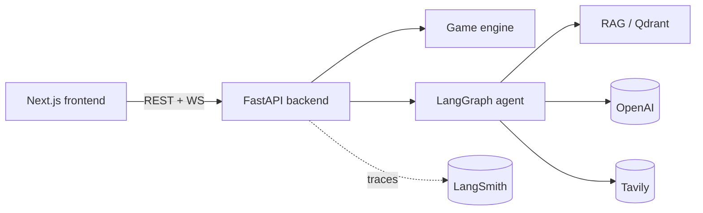

# 1000 Blank White Cards

A digital, AI-refereed implementation of the party game **1000 Blank White Cards**, where players draw, write, and play their own cards to invent the game as they go.

## What it is

1000 Blank White Cards is a party game with no fixed rules: players write free-text cards ("Gain 5 points", "Everyone swaps hands", "Draw a cat, +2 to anyone who compliments it") and play them to make up the game collaboratively. This project brings that to a realtime web app where an **AI referee** — a LangGraph agent backed by retrieval-augmented generation (RAG) — reads each hand-written card, interprets its intent, and turns it into executable game effects. Multiple players join a shared room over WebSockets and play together in the browser.

## Architecture

- **Backend** — FastAPI app (`src/tbwc/`) exposing REST endpoints for rooms and a `/ws/{room_code}` WebSocket for realtime play. Key packages:
  - `models/` — Pydantic domain models (cards, players, game state).
  - `engine/` — deterministic game engine that applies interpreted effects to state.
  - `agent/` — LangGraph agent that interprets free-text cards into structured effects.
  - `rag/` — retrieval over a card corpus (Qdrant vector store) to ground interpretation.
  - `sandbox/` — guarded execution of generated snippets (toggle via `SNIPPET_EXECUTION_ENABLED`).
  - `rooms/` — in-memory room/session management.
  - `evals/` — offline evaluation harness and A/B experiments.
- **Frontend** — Next.js 16 app in `frontend/` that talks to the REST + WebSocket API.
- **External services** — OpenAI (chat + embeddings), Tavily (agent web search), Qdrant (vector store), LangSmith (optional tracing/observability).



## Quickstart — Backend

**Prerequisites:** [`uv`](https://docs.astral.sh/uv/getting-started/installation/) and Python 3.14 (uv can install it for you).

```bash
# 1. Install uv (if needed)
curl -LsSf https://astral.sh/uv/install.sh | sh

# 2. Install Python 3.14 + dependencies
uv python install
uv sync

# 3. Configure environment
cp .env.example .env
# Edit .env and set OPENAI_API_KEY (required).
# Optional: TAVILY_API_KEY, LANGSMITH_*, QDRANT_* (see comments in .env.example).

# 4. Run the API
uv run uvicorn tbwc.app:app --reload

# 5. Health check
curl localhost:8000/health
```

### Docker

```bash
docker build -t tbwc .
docker run -p 8000:8000 --env-file .env tbwc
```

## Quickstart — Frontend

```bash
cd frontend
npm install

# Configure environment
cp .env.example .env.local
# Set NEXT_PUBLIC_API_URL (e.g. http://localhost:8000)
# and NEXT_PUBLIC_WS_URL (e.g. ws://localhost:8000).

npm run dev
```

Then open [http://localhost:3000](http://localhost:3000). Make sure the backend is running first.

## Testing & quality

```bash
uv run pytest              # 367 tests, ~91% coverage (fails under 80%)
uv run ruff check .        # lint
uv run ruff format --check .   # formatting check
```

Optionally install pre-commit hooks (linting/testing also run in CI):

```bash
uvx prek install
```

## Evals

Offline evaluation of the agent + retriever. All eval scripts call OpenAI, so set `OPENAI_API_KEY` first.

```bash
uv run python -m tbwc.evals.harness          # main eval harness
uv run python -m tbwc.evals.retriever_ab     # retriever A/B comparison
uv run python -m tbwc.evals.improvement_ab   # few-shot before/after eval
```

See [`src/tbwc/evals/RETRIEVER_ANALYSIS.md`](src/tbwc/evals/RETRIEVER_ANALYSIS.md) for retriever analysis.

## Deployment

- **Backend** — deployed to [Render](https://render.com) via [`render.yaml`](render.yaml) (Docker runtime, `/health` health check). See [`docs/deploy/render-steps.md`](docs/deploy/render-steps.md).
- **Frontend** — deployed to [Vercel](https://vercel.com). See [`docs/deploy/vercel-steps.md`](docs/deploy/vercel-steps.md).
- **Observability** — LangSmith setup in [`docs/deploy/langsmith-setup.md`](docs/deploy/langsmith-setup.md).
- **Smoke test** — post-deploy checklist in [`docs/deploy/smoke-checklist.md`](docs/deploy/smoke-checklist.md).

## Docs & links

- [Project write-up](docs/WRITEUP.md) — problem, solution, architecture diagrams, eval results, and Demo Day notes (rubric tasks 1–7).
- [Retriever analysis](src/tbwc/evals/RETRIEVER_ANALYSIS.md) — eval findings.
- [Loom demo script](docs/loom-script.md) — timed ≤10-minute demo walkthrough.
- [Deployment docs](docs/deploy/) — Render, Vercel, LangSmith, and smoke checklist.
</content>
</invoke>
