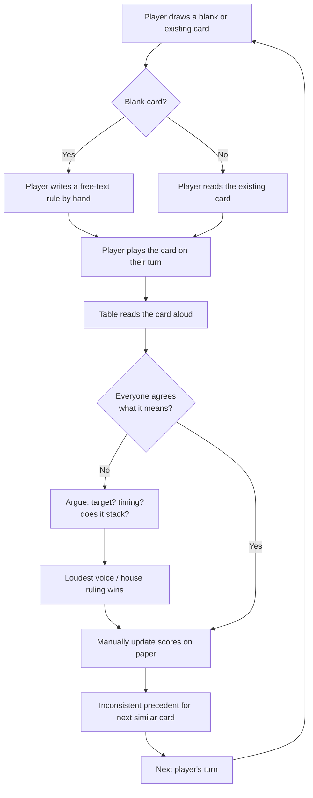
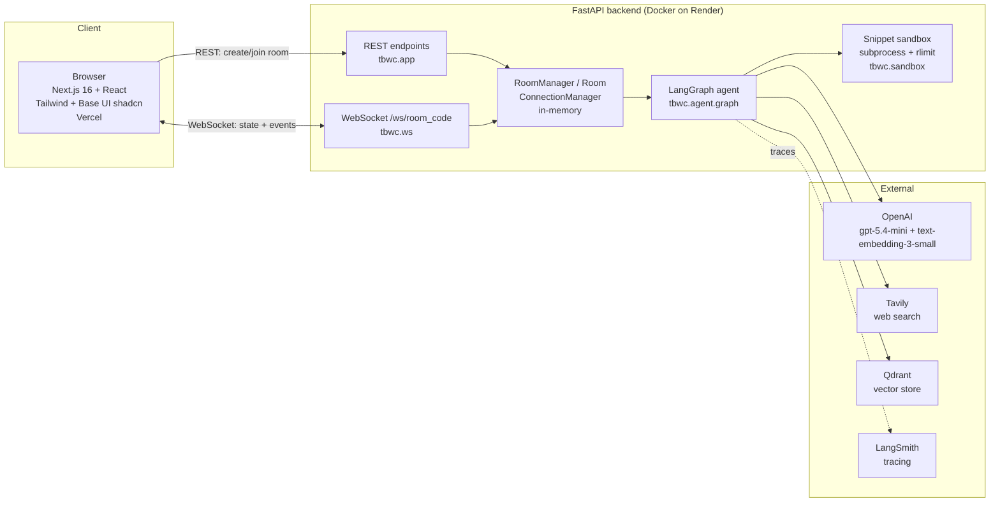
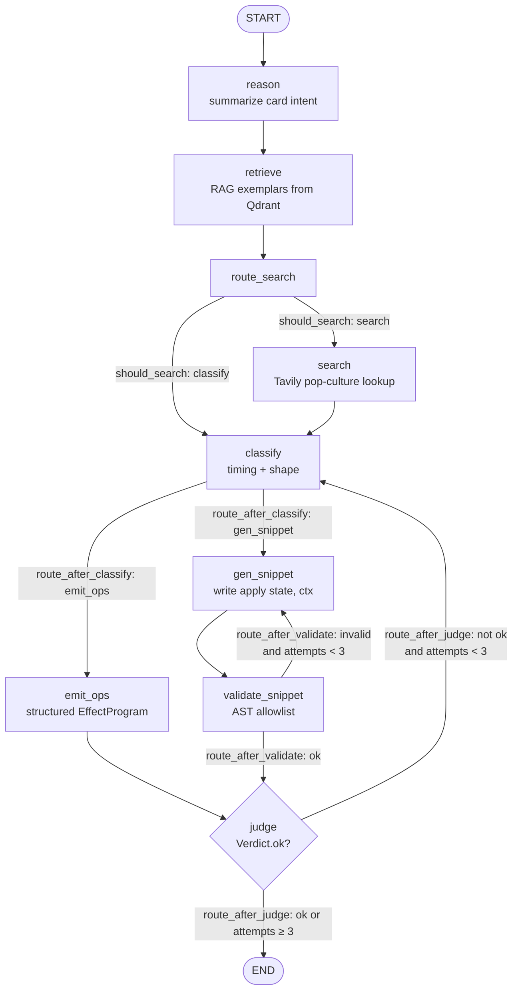

# 1000 Blank White Cards — Project Writeup

An AI referee for the party game *1000 Blank White Cards* (TBWC). Players invent
cards on the fly by writing free-text rules; this system interprets that free text
into an executable effect program and runs it against a deterministic game engine,
in realtime, for a multiplayer room.

This document covers the seven rubric sections for the milestone deliverable
(`m3r.8`–`m3r.14`). File and module names throughout refer to the actual codebase
(`src/tbwc/`, `frontend/`, `data/`).

---

## Task 1 — Problem & Audience

**Problem (one sentence):** In *1000 Blank White Cards*, players invent cards with
free-text rules mid-game, and adjudicating what each hand-written card *does* is
slow, inconsistent, and argument-prone — an AI referee can read that free text and
execute it fairly and instantly.

**Why it matters.** The entire appeal of TBWC is creative chaos: anyone can grab a
blank card, scribble "steal 8 points from whoever's winning" or "everyone must
stand up — last one seated loses 5," and drop it into the deck. The *fun* is the
invention. The *friction* is arbitration. Every novel card triggers a table-wide
negotiation: Who is "whoever's winning"? Does this happen now or every turn? Does it
stack with the modifier already sitting in front of me? In a paper game these
questions are resolved by whoever argues loudest, the rulings are inconsistent from
card to card, and the momentum of the party dies while four people re-litigate a
scribble on an index card.

The audience is **party gamers** — casual groups who want to keep inventing and keep
laughing, not maintain a rules lawyer. By interpreting each card into a small,
inspectable effect program (add points, skip a turn, reverse order, steal, set a win
condition, or a sandboxed custom snippet) and applying it through a deterministic
engine, the referee removes the arbitration tax while preserving the creativity.
Players still write anything they want; they just don't have to argue about what it
means.

### Current (manual / paper) workflow



### Evaluation Q/A pairs (grounding the eval harness)

These realistic card → interpretation pairs mirror the annotations in
`data/eval/real_cards.json` and define the behavior the eval harness scores. Each
answer is expressed in the engine's op vocabulary (see
`src/tbwc/models/effects.py`) with target and timing.

| # | Card text (Q) | Interpretation (A) |
| - | --- | --- |
| 1 | "When you play this card, gain 5 points." | `add_points` target=`self` amount=+5, timing=immediate |
| 2 | "Every player loses 10 points. No exceptions." | `add_points` target=`all` amount=−10, timing=immediate |
| 3 | "The player to your left loses their next turn." | `skip_turn` target=`left_neighbor`, timing=immediate |
| 4 | "That was fun. Take another turn right now." | `extra_turn` target=`self`, timing=immediate |
| 5 | "Reverse the direction of play." | `reverse_order`, timing=immediate |
| 6 | "Your hand is looking thin. Draw 3 cards." | `draw_cards` target=`self` amount=3, timing=immediate |
| 7 | "Steal 8 points from the player with the most points." | `steal_points` from=`player_with_most_points` to=`self` amount=8, timing=immediate |
| 8 | "Give 10 of your points to another player of your choice." | `add_points` self −10 **+** `add_points` chooser +10, timing=immediate, `requires_choice=true` |
| 9 | "Forget 1000 — first player to reach 250 wins." | `set_win_condition` kind=`first_to` threshold=250, timing=immediate |
| 10 | "Destroy any one card currently in play." | `destroy_card` (chooser-selected), timing=immediate, `requires_choice=true` |
| 11 | "Keep this in front of you. At the start of each of your turns, gain 3 points." | `add_points` self +3, timing=**modifier** (persistent, on start-of-turn hook) |
| 12 | "Whenever any player draws a card, that player loses 1 point." | `add_points` target=drawing player −1, timing=**modifier** (triggered on draw) |
| 13 | "From now on everyone draws one fewer card each turn." | `change_draw_count` amount=−1, timing=modifier |
| 14 | "Never gonna give you up! Sing the chorus or lose 6 points." | `custom_note` (social action) with fallback `add_points` self −6; pop-culture card |
| 15 | "This card is intentionally left blank. It does nothing." | `custom_note` "no mechanical effect" — flavor-only, no score change |

---

## Task 2 — Solution, Infra & Agent Workflow

**Solution (one sentence):** A realtime multiplayer web app whose backend runs each
free-text card through a LangGraph interpretation agent (reason → RAG retrieve →
optional web search → classify → emit ops *or* generate a sandboxed Python snippet →
LLM judge) into a validated effect program, then applies it via a deterministic,
immutable game engine and broadcasts the new state over WebSockets.

### Infrastructure



### Agent workflow (LangGraph interpretation graph)

Nodes and edges match `src/tbwc/agent/graph.py`. `MAX_ATTEMPTS = 3` bounds both
retry loops so the graph always terminates.



**Tool choices.** *LangGraph* models the interpretation as an explicit branching
state graph — the card either resolves to a structured `EffectProgram` (`emit_ops`)
or to a generated Python snippet (`gen_snippet`), and both the snippet validator and
the judge feed **bounded retry loops** back into earlier nodes; a graph makes those
branches and loops first-class and traceable rather than tangled control flow.
*Qdrant* (in-memory for dev, swappable for cloud) holds the seed-card embeddings for
RAG so the generator can mirror known-good exemplars. *OpenAI* supplies both the
chat model (`gpt-5.4-mini`) and embeddings (`text-embedding-3-small`) — one vendor,
one key, for classification/generation/judging and for the vector index. *Tavily*
is invoked only when the card leans on outside knowledge (a movie quote, a song
lyric), so pop-culture cards like "Rickrolled" or "One Does Not Simply" get grounded
context. For anything the fixed op vocabulary can't express, the model writes a
small `def apply(state, ctx)` snippet that runs behind a **subprocess + AST
allowlist sandbox** (`tbwc.sandbox`), never in-process. *FastAPI + WebSockets* give
low-latency realtime state fan-out to every seat in a room, with plain REST for
create/join. *LangSmith* traces every graph run for debugging judge and retry
behavior.

---

## Task 3 — Data Sources, External APIs, Chunking

### Data sources

- **`data/seed_cards.json`** — 60 seed cards total: **20 gold, human-annotated**
  cards (`data/seed_cards_gold.json`) each carrying a canonical effect, plus **40
  filler** cards (`data/seed_cards_fillers.json`) for corpus breadth. Loaded into
  Qdrant at server startup (`tbwc.app` lifespan → `tbwc.rag.seed`) and used as RAG
  retrieval exemplars.
- **`data/eval/real_cards.json`** — **35 real, annotated cards** used exclusively as
  the eval test set (never as retrieval context). Each has a `human_canonical`
  annotation with `timing`, `target`, `placement`, `trigger_event`, `ops`, and
  `magnitude_sign`. Authored per `data/eval/ANNOTATION_GUIDE.md`.
- **Player-authored cards at runtime** — the live, unbounded source: whatever a
  player types on a blank card during a game. These are what the agent actually
  interprets in production.

### External APIs

| Service | Use | Model / detail |
| --- | --- | --- |
| **OpenAI** | Chat + embeddings | `gpt-5.4-mini` (reason/classify/emit/gen/judge), `text-embedding-3-small` (RAG index) |
| **Tavily** | Web search | Pop-culture / outside-knowledge lookups in the `search` node |
| **Qdrant** | Vector store | Seed-card embeddings; in-memory dev, cloud-swappable via `QDRANT_URL` |
| **LangSmith** | Tracing | Per-run observability of graph + judge (opt-in via `LANGSMITH_TRACING`) |

### Chunking strategy

**One card = one document; no splitting.** Cards in TBWC are *naturally atomic
units* — a short title plus a one- or two-sentence rule. Each card is embedded as a
single document of the form `"{title}\n{description}"`. There is no recursive or
fixed-window chunking because a card *is* the chunk: the title and description
together express exactly one rule, and splitting them would fragment a single
coherent effect (e.g. severing "at the start of each turn" from "gain 3 points"),
destroying the very intent the retriever needs to match on.

The canonical effect program and provenance (source, annotation) travel as **payload
metadata on the vector point, not inside the embedded text**. That keeps the
embedding focused on the natural-language intent (what the retriever matches
against) while the structured effect is available downstream — as the exemplar the
generator mirrors and as few-shot guidance in `emit_ops` — without polluting the
semantic vector with schema tokens.

---

## Task 4 — Deployed Prototype Links

> **These are placeholder URLs pending a live deploy — not yet reachable.** The
> deployment is fully infrastructure-as-code, so bringing them up is a matter of
> running the documented steps with real API keys.

- **Frontend (Vercel):** `https://tbwc.vercel.app` *(placeholder — to be filled
  after deploy)*
- **Backend (Render):** `https://tbwc-backend.onrender.com` *(placeholder — to be
  filled after deploy)*

The stack is IaC-defined:

- **Backend** — `render.yaml` (a Render `web` service, Docker runtime, `/health`
  healthcheck, secret env vars synced at deploy time) built from the repo
  `Dockerfile` (Python 3.14 slim, `uv sync --frozen`, `uvicorn tbwc.app:app`).
- **Frontend** — Next.js 16 app in `frontend/`, deployed on Vercel.

Step-by-step deploy instructions and verification live under `docs/deploy/`:
`render-steps.md` (backend), `vercel-steps.md` (frontend),
`langsmith-setup.md` (tracing), and `smoke-checklist.md` (post-deploy smoke test).
Once deployed, replace the placeholder URLs above with the live ones.

---

## Task 5 — Eval Harness, Test Set, Conclusions

### Harness

`tbwc.evals.harness` (`run_harness`) is the measurement instrument. It:

1. Loads the 35-card test set via `load_eval_items` from
   `data/eval/real_cards.json`, using each card's `human_canonical` block as the
   expected value.
2. Runs the **compiled agent graph** (`from tbwc.agent.graph import graph`) on each
   card — the exact production interpretation pipeline — and normalizes the graph
   output (`_normalise_graph_output`) into the keys the scorers expect
   (`effect_program`, `snippet_effect`, `classification`).
3. Scores every card with the four scorers in `ALL_SCORERS`
   (`src/tbwc/evals/scorers.py`) and reports per-dimension means plus
   `mean_task_latency_ms`.

**The four scorers:**

| Scorer | Type | What it measures |
| --- | --- | --- |
| `intent_match` | LLM judge | Does the generated effect do what the card says? |
| `dsl_validity` | **Deterministic / structural** | Is `effect_program` a non-empty, Pydantic-valid `EffectProgram`? |
| `target_accuracy` | LLM judge | Is the effect's target/placement correct? |
| `timing_accuracy` | LLM judge | Is the timing (immediate / persistent / triggered) correct? |

Three of the four are **LLM-judge based**, sharing a single `gpt-5.4-mini` judge
(`tbwc.evals.judge.JudgeLLM`) that returns a structured multi-dimensional `Verdict`.
Only `dsl_validity` is deterministic — it is the **structural gate**: a program that
fails it is unusable regardless of semantics.

### Test set

35 real, annotated cards spanning the full effect surface:

- **Points** — flat gains/losses to self, all, or a chosen player ("Gain 5 Points",
  "Tax Season", "Windfall", "Grand Finale").
- **Turns & order** — `skip_turn`, `extra_turn`, `reverse_order` ("Skip It", "Go
  Again!", "Backwards Day", "Time Out").
- **Draws** — immediate and rate-changing ("Draw Three", "Big Bonus Draw",
  "Double Draw", "Slow Draw" via `change_draw_count`).
- **Steal / transfer** — `steal_points` and multi-op give ("Robin Hood",
  "Point Vampire", "Generous Gift").
- **Modifiers (persistent / triggered)** — start-of-turn and end-of-turn hooks,
  draw-triggered penalties, win-condition changes ("Passive Income",
  "Cursed Amulet", "Draw Tax", "New Win Condition").
- **Snippets & social / flavor** — cards with no fixed op ("Great Depression"
  halving scores, "Score Doubler"), pure `custom_note` flavor ("Blank White Card",
  "Motivational Poster"), and **pop-culture** cards ("Rickrolled",
  "One Does Not Simply") that exercise the Tavily search branch.

### Conclusions

Conclusions are generated by `tbwc.evals.conclusions` into
`data/eval/conclusions.md`. That script runs `run_harness`, then renders a
per-dimension score table, the percentage of cards producing a valid
`EffectProgram`, and mean per-card latency, followed by a data-driven analysis
paragraph that automatically names the strongest and weakest judged dimensions.

**Methodology, honestly stated:** `dsl_validity` is the trustworthy structural gate
— fully deterministic, it is the single most reliable number and the clearest
signal that the pipeline emits real, in-vocabulary op programs. The three judge
scores (`intent_match`, `target_accuracy`, `timing_accuracy`) capture *semantic
fidelity* — whether the effect actually does the right thing to the right players at
the right time — but carry LLM-judge variance and should be read as directional
signal over 35 cards, not high-precision measurements.

**The concrete numbers require a live run.** Both `harness` and `conclusions` drive
the agent graph *and* the judge, so they need a live `OPENAI_API_KEY`:

```bash
OPENAI_API_KEY=sk-... uv run python -m tbwc.evals.conclusions
```

Until that runs against a funded key, `data/eval/conclusions.md` cannot contain real
measured figures — this writeup deliberately does not invent them.

---

## Task 6 — Advanced Retriever + One Other Improvement

Full justification, methodology, and A/B tables live in
`src/tbwc/evals/RETRIEVER_ANALYSIS.md`. Summary below.

### Advanced retriever — multi-query expansion vs dense baseline

The baseline is a plain **dense** retriever (single embedding of the card text).
The advanced retriever is **`MultiQueryCardRetriever`** (`advanced_retriever()` in
`src/tbwc/rag/retrievers.py`). Both satisfy the same
`Retriever = Callable[[str, int], list[dict]]` interface, so the graph switches
between them purely via the `retriever_mode` config key (`"dense"` vs `"advanced"`)
with no graph changes.

**Why the baseline is a poor fit:** TBWC card text is terse, colloquial, and
in-joke-laden ("everybody drinks", "steal a point, jerk"). The *same* effect program
gets phrased four different ways ("give a player 5 points" / "someone gets +5" /
"5 pts to a friend"), landing far apart in embedding space. A single embedding
biases retrieval toward lexical near-duplicates and misses cards that share the
*effect structure* but differ in words — a **narrow-recall** failure mode.

**How multi-query fixes it:** it prompts the LLM to generate `n` (default 3)
intent-focused paraphrases of the card, runs the original plus each paraphrase
through the same base dense retriever, and returns the **deduplicated union** (keyed
by `card_id`, falling back to `title`). Each paraphrase lands in a different
neighborhood, so the union covers a broader, more diverse — and more structurally
relevant — exemplar set. Paraphrase generation is non-fatal: on LLM/JSON failure it
logs a warning and falls back to the original query, degrading gracefully to the
dense baseline. The cost is latency (one extra LLM call + `n` extra vector lookups).

**A/B driver:** `tbwc.evals.retriever_ab` runs the same graph over the 35-card set
twice (`dense` vs `advanced`), scores with `ALL_SCORERS`, and prints a comparison
table with per-dimension deltas and `mean_task_latency_ms`. Run with
`uv run python -m tbwc.evals.retriever_ab`.

> **ILLUSTRATIVE placeholder numbers** (from `RETRIEVER_ANALYSIS.md`) — regenerate
> with a live `OPENAI_API_KEY`. These show expected *direction*, not measurements.

| Metric | dense | advanced | delta |
| --- | ---: | ---: | ---: |
| intent_match | 0.71 | 0.78 | +0.07 |
| dsl_validity | 0.83 | 0.86 | +0.03 |
| target_accuracy | 0.74 | 0.79 | +0.05 |
| timing_accuracy | 0.80 | 0.82 | +0.02 |
| mean_task_latency_ms | 3200 | 4600 | +1400 |

*Expected shape:* the advanced retriever lifts the judge dimensions (especially
`intent_match`) by surfacing more structurally-relevant exemplars, at the cost of
higher per-card latency.

### One other improvement — few-shot exemplar injection in `emit_ops`

The second improvement targets **generation**, not retrieval. `emit_ops`
(`src/tbwc/agent/nodes.py`) already uses
`ChatOpenAI.with_structured_output(EffectProgram)`, so the *schema* is
Pydantic-enforced — but the model still chooses *which* ops and field names to emit,
and with TBWC's idiosyncratic text it tends to invent plausible-but-nonexistent op
shapes. Structured output catches malformed JSON; it does not catch a well-typed but
semantically wrong program.

**The fix:** inject the **top-3 retrieved exemplars with their canonical effects** as
few-shot patterns directly into the `emit_ops` prompt (`_format_exemplars_fewshot`),
so the model mirrors concrete, in-vocabulary op patterns instead of inventing them.
It is gated by the `few_shot_exemplars` config toggle (default `True`), which makes a
clean before/after A/B possible. The two improvements **compound** — better
retrieval yields better exemplars, which makes few-shot injection more effective.

**A/B driver:** `tbwc.evals.improvement_ab` runs the 35-card set twice toggling only
`few_shot_exemplars` (retriever held fixed), so the delta is attributable to
few-shot alone. Run with `uv run python -m tbwc.evals.improvement_ab`.

> **ILLUSTRATIVE placeholder numbers** — regenerate via the script with a live
> `OPENAI_API_KEY`.

| Metric | before (no few-shot) | after (few-shot) | delta |
| --- | ---: | ---: | ---: |
| intent_match | 0.70 | 0.77 | +0.07 |
| dsl_validity | 0.79 | 0.91 | +0.12 |
| target_accuracy | 0.73 | 0.78 | +0.05 |
| timing_accuracy | 0.79 | 0.81 | +0.02 |
| mean_task_latency_ms | 3100 | 3300 | +200 |

*Expected shape:* few-shot injection lifts `dsl_validity` the most — its whole
purpose is to stop the model inventing invalid op shapes — with a secondary lift to
`intent_match`, and near-flat latency (it adds prompt tokens, not round-trips, since
the exemplars are already retrieved upstream).

---

## Task 7 — Keep vs Change for Demo Day

**What I'd keep.** The core architecture has earned its place. The **deterministic,
immutable game engine** (`src/tbwc/engine/` — pure reducers, `apply`, `hooks`,
`loop`, `scoring`, `epilogue`) is the foundation everything else trusts: the agent
can be wrong, but state transitions are pure functions of `(state, op)`, so a game is
always reproducible and auditable, and the AI's fallibility never corrupts the board.
I'd keep the **LangGraph judge loop** — routing an interpretation back through
`classify` up to `MAX_ATTEMPTS` when the `Verdict` is not `ok` is what lets a
best-effort LLM converge on a usable program instead of shipping its first guess.
I'd keep the **layered sandbox** as a design (subprocess boundary + AST allowlist in
`tbwc.sandbox.validate` + revalidation), because generated code must never run
in-process. And I'd keep the **realtime WebSocket multiplayer** (`tbwc.ws`,
`ConnectionManager`, `Room`) — instant state fan-out to every seat is what makes it
feel like a party game rather than a form submission.

**What I'd change.** First, **persistence**: `RoomManager` is explicitly in-memory
("rooms are NOT persisted — a server restart clears all games"), which is fine for a
demo but loses every game on a Render redeploy or free-tier sleep. I'd move room and
game state to durable storage (Postgres or Redis) so games survive restarts and can
scale past one process. Second, **a hardened sandbox**: subprocess + `rlimit` is a
real boundary but not a strong one — for anything beyond a demo I'd move snippet
execution to gVisor / Firecracker microVMs or a hosted code-exec service, one
isolated environment per execution. Third, **cost and latency**: I'd add retriever
and paraphrase caching (the multi-query expansion's extra LLM call is the biggest
latency hit) and **stream interpretations** to the client so players see the referee
"thinking" instead of waiting on a spinner.

Finally, the demo-facing polish: a better **blank-draw UX** — a first-class card
composer with live validation and a preview of the interpreted effect *before* the
card is committed, so players learn what phrasings the referee understands — and
**real deployed eval numbers**. Everything in Tasks 5 and 6 is wired and runnable;
the honest gap is that the A/B tables and `conclusions.md` still hold illustrative
placeholders. Before demo day I'd run `tbwc.evals.conclusions`,
`tbwc.evals.retriever_ab`, and `tbwc.evals.improvement_ab` against a funded
`OPENAI_API_KEY`, replace every placeholder with measured figures, and stand up the
live Vercel + Render URLs from Task 4.
