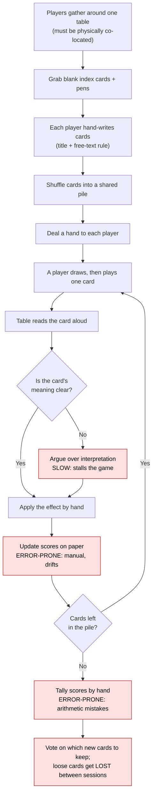
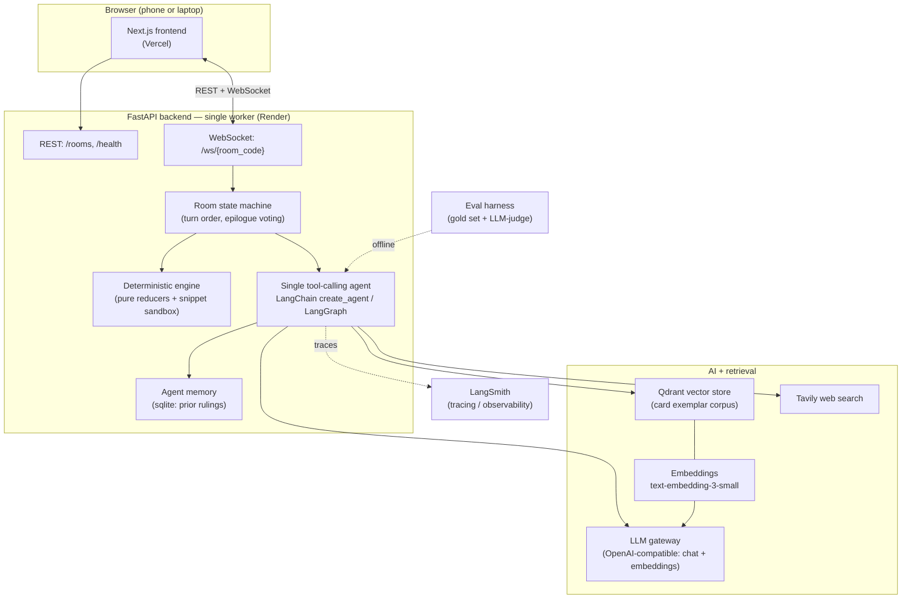

# 1000 Blank White Cards — Certification Challenge Writeup

This is the submission document for **1000 Blank White Cards (TBWC)** — an
AI-arbitrated, real-time party card game. It addresses the seven challenge tasks in
order. It deliberately does **not** repeat the deep technical reference: for module
boundaries, the import-layering contract, the WebSocket flow, the engine + sandbox
model, and the full RAG pipeline, see [`docs/architecture.md`](architecture.md). The
two authoritative hand-authored design sketches are
[`docs/game.excalidraw.svg`](game.excalidraw.svg) (the game-system shape) and
[`docs/agent.excalidraw.svg`](agent.excalidraw.svg) (the agent shape); the Mermaid
diagrams here complement them.

---

## Task 1 — Problem, Audience, and Scope

### Problem (one sentence)

Software that runs card and board games hard-codes each game's rules, so it cannot
host a game whose cards are free-text, natural-language rules that players invent on
the fly.

### Who has this problem, and why today's answer isn't good enough

The people with this problem are **improv and party-game hobbyists** — the
BoardGameGeek / *1000 Blank White Cards* crowd who love games where the rules are
emergent and the whole point is that you make cards up as you go. What they are
trying to do is play a game whose content is authored *during* play: someone
scribbles "Steal 8 points from whoever's winning" or "everyone swaps hands" on a
blank card, plays it, and the table has to agree what it does. No shipped digital
board-game engine supports this, because every such engine (Tabletop Simulator's
scripted mods, Board Game Arena, dedicated app ports) encodes a fixed rulebook; a
card the designers never anticipated simply has no code path.

So today hobbyists fall back to **playing on paper, physically co-located** — a
stack of blank index cards, pens, and a sheet for keeping score around one table.
That works, but it is slow and error-prone in specific, repeatable ways: score-keeping
is manual and drifts (someone forgets a −10), rules disputes stall the game while
the table argues what an ambiguous card means, handwriting is illegible, cards get
lost between sessions, and — most limiting — **everyone has to be in the same room**.
There is no good way to play remotely, and nothing carries the good cards forward
from one night to the next. The analog game is charming but doesn't scale past the
kitchen table.

### Today's workflow (how hobbyists play now)



The red nodes are the slow / repetitive / error-prone points: **rules disputes**
(manual interpretation), **manual score-keeping and tallying** (drift and arithmetic
mistakes), and the **lost / illegible physical cards** that never make it to the next
game night. The co-location requirement at the very top gates the whole thing.

### Example evaluation input → output pairs

The application's core job is to translate a card's free text into the engine's
structured effect vocabulary. These pairs (drawn from
[`data/eval/eval_cards.json`](../data/eval/eval_cards.json), the 35-card gold set) are
the shape of what we evaluate — card text in, canonical interpretation out:

| Card text (input) | Expected interpretation (output) |
| --- | --- |
| *"Gain 5 Points"* — "When you play this card, gain 5 points." | `add_points{target: self, amount: 5}`, immediate, on-play |
| *"Tax Season"* — "Every player loses 10 points. No exceptions." | `add_points{target: all, amount: -10}`, immediate, on-play, center |
| *"Robin Hood"* — "Steal 8 points from the player with the most points." | `steal_points{target: player_with_most_points, amount: 8}`, immediate |
| *"Backwards Day"* — "Reverse the direction of play." | `reverse_order`, immediate, affects all |
| *"Double Draw"* — "From now on, everyone draws 2 cards at the start of their turn." | `change_draw_count{target: all, count: 2}`, **modifier** (persistent), not immediate |
| *"Victory Bonus"* — "When the game ends, whoever holds this card gains points." | `add_points`, **modifier**, `trigger_event: on_game_end` |
| *"Compliment Circle"* — "Give the player on your right a genuine compliment." | no compilable op → social/`custom_note` card; agent picks a persona action |
| *"Blank White Card"* — "This card is intentionally left blank. It does nothing." | `custom_note`, no score change |

The gold set spans every op family (points, steal, skip/extra-turn, reverse,
draw-count, destroy, win-condition, custom-note) and both timings (immediate vs.
persistent modifier), plus the "no mechanical effect / social" cards that force the
agent's fallback persona behaviour.

---

## Task 2 — Proposed Solution

### Solution (one sentence)

A real-time multiplayer web app in which players write and play free-text cards, and
a single tool-calling LLM agent interprets each card's natural language into an
executable game effect that a deterministic engine applies — so the game invents its
own rules as you play, from any browser.

### Infrastructure diagram



**One sentence justifying each component:**

- **LLM (via OpenAI-compatible gateway)** — the core natural-language reasoner that
  reads a free-text card and decides its effect; routing through a single
  OpenAI-compatible gateway ([`src/config.py`](../src/config.py) `Settings`) lets us
  point at hosted OpenAI, a company gateway (e.g. bifrost → Bedrock), or a local
  server without touching code, and satisfies the "LLM gateway of your choice"
  requirement.
- **Agent orchestration (LangChain `create_agent`, built on LangGraph)** — verified in
  [`src/agent/runtime.py`](../src/agent/runtime.py); a *single* tool-calling agent
  (not multi-agent) with a hard tool-call cap and wall-clock timeout gives the model
  the freedom to look things up while staying bounded and never hanging.
- **Tools (Tavily `web_search`, `card_rag`, `game_rules`, `mtg_lookup`,
  `read_engine_methods`, `read_game_state`, `agent_memory`)** — the agent needs to
  look up outside references, retrieve similar past cards, read the actual engine
  vocabulary, and inspect the live board to interpret a card correctly rather than
  guessing (see [`src/agent/tools/`](../src/agent/tools/)).
- **Embedding model (`text-embedding-3-small`, 1536-dim, via the same gateway)** —
  turns card text into vectors so we can retrieve structurally-similar exemplars; it
  runs through the one gateway so a single credential drives both chat and embeddings.
- **Vector DB (Qdrant, in-memory `cards` collection)** — stores the exemplar-card
  corpus and serves cosine top-k retrieval; in-memory keeps the prototype
  zero-infra while the same client can point at a hosted Qdrant later.
- **Monitoring (LangSmith)** — traces each agent run (tool calls, prompts, judge
  calls) for debugging interpretation quality; wired but off by default behind
  `Settings.langsmith_tracing`.
- **Eval framework (`src/evals` harness + LLM-as-judge)** — an offline harness that
  scores interpretation quality on a hand-annotated gold set, so improvements are
  measured, not asserted (Task 5).
- **Memory (sqlite `agent_memory`)** — persists the agent's own prior card rulings so
  its interpretations stay consistent across cards and games, and survives process
  restarts (the rooms themselves are in-memory); this satisfies the "must have a
  memory component" requirement.
- **UI (Next.js)** — a browser client so anyone can join a room from a phone or a
  laptop with no install (satisfies "run it on my phone and laptop in a browser").
- **Deployment (Render backend + Vercel frontend)** — Render runs the single-worker
  FastAPI/WebSocket backend from a Docker image; Vercel serves the Next.js frontend
  at the edge (Task 4).

### Agent-workflow diagram

```mermaid
sequenceDiagram
  participant P as Player (browser)
  participant R as Room (server, turn guards)
  participant C as Deterministic compile
  participant A as Tool-calling agent
  participant RAG as Qdrant / RAG
  participant T as Tools (web/state/memory/rules)
  participant E as Engine (apply effect)
  participant V as Table (epilogue vote)

  P->>R: play card (or author a blank on play)
  R->>C: try compile_card → structured ops?
  alt simple point card (compiles)
    C-->>R: EffectProgram (no LLM needed)
  else free-text / novel card
    R->>A: run_agent(title, desc, live state, actor)
    A->>RAG: retrieve similar exemplar cards
    A->>T: read game state / rules / memory / web search as needed
    A-->>R: InterpretResult (effect program + in-character comment)
  end
  R->>R: if effect needs a target → prompt player to choose
  R->>E: apply_effect → new game state
  E-->>R: updated scores / board
  R->>P: broadcast state + effect_applied to all players
  Note over R,V: game end → epilogue: table VOTES which<br/>new cards to keep; kept cards re-enter the corpus
```

**How the workflow solves the problem (narrative).** A player's input is a card
they play — and if it's a blank card, they author its title and free-text rule at the
moment they play it. The Room first tries the **deterministic path**: `compile_card`
lowers simple, recognizable cards (plain point changes, skips, draws) straight to
structured ops with no LLM call at all — fast, free, and unambiguous. The agent is
invoked **only when a card carries no compilable ops** (a novel or free-text card).
At that decision point the single tool-calling agent reads the card and reasons about
it, **retrieving** similar past cards from the Qdrant exemplar corpus (RAG) to mirror
known-good effect patterns, and calling other tools as needed: `read_game_state` to
see the live board (who's winning, whose turn), `game_rules` and `read_engine_methods`
to ground itself in the actual effect vocabulary, `agent_memory` to stay consistent
with its own past rulings, and `web_search` (Tavily) to resolve a meme or pop-culture
reference in the card text. It returns a structured `InterpretResult` — an effect
program plus an in-character comment — which the engine applies deterministically to
produce the new game state, broadcast live to every player.

**Human review / approval** shows up in two places. During play, if an effect needs a
choice ("steal from *which* player?"), the server pauses and **prompts the acting
player to choose** before applying. And at game end, the **epilogue vote** lets the
whole table decide which newly-written cards are good enough to keep — the kept cards
are upserted back into the RAG corpus, so human curation directly grows and improves
the exemplar pool the agent learns from. The agent never silently fails: on
cap/timeout/error it returns a deterministic fallback (a persona action or a
`custom_note`), so play always continues.

**Requirements satisfied:** uses an **LLM gateway** (one OpenAI-compatible endpoint
for chat + embeddings), has a **memory component** (sqlite agent-memory of prior
rulings), and **runs in a browser on phone + laptop** (Next.js client over REST +
WebSocket).

---

## Task 3 — Dealing with the Data

### Default chunking strategy — and why

**One card per document (no sub-document splitting).** Each exemplar card is embedded
as a single unit: `upsert_card` (in [`src/agent/rag/store.py`](../src/agent/rag/store.py))
embeds the concatenation of the card's **title + description** and stores the
structured `canonical` effect and `source` as unembedded payload. This is the right
chunking granularity here because the documents are *already* tiny — a card is a title
and a sentence or two of rule text, far shorter than any sensible chunk window.
Splitting a card would destroy exactly the signal we retrieve on: a card's meaning is
the whole title-plus-rule unit, and the retrieval goal is "find cards whose *effect
structure* resembles this one," which only makes sense at the card level. So the
natural atomic document — one card — is also the natural chunk. Point ids are a stable
hash of the card id, which makes re-seeding idempotent.

### Data source and external API, and how they interact

**Personal data source (RAG corpus).** The retrieval corpus is our own curated card
collections: [`data/seed_cards.json`](../data/seed_cards.json) (the exemplar cards
loaded into Qdrant at startup by `rag/seed.py`) plus the hand-annotated gold set
[`data/eval/eval_cards.json`](../data/eval/eval_cards.json) used for evaluation. These
are cards with known-good canonical effects — the "here's how a card like this should
be interpreted" examples the agent imitates. The corpus is **not static**: cards the
table votes to keep in the epilogue are upserted back in with `source="player"`, so it
grows with play.

**External API (Tavily web search).** Tavily is the agent's `web_search` tool
([`src/agent/tools/web_search.py`](../src/agent/tools/web_search.py)), used to resolve
external references a card leans on — a meme, a pop-culture phrase, a game term — that
the model needs to look up to interpret the card faithfully (e.g. "Rickrolled",
"One does not simply walk into Mordor").

**How they interact during a turn.** When the agent interprets a free-text card, it
first leans on the **personal corpus (Qdrant RAG)** to find structurally-similar
exemplars and mirror their canonical effect patterns — this is the primary grounding.
It reaches for the **external API (Tavily)** only opportunistically, when the card
references something outside the game that isn't resolved by the exemplars. RAG
answers "what kind of effect is this, mechanically?"; web search answers "what does
this cultural reference mean?" Both are defensively non-fatal — a missing Tavily key
or an offline gateway degrades gracefully to a smaller toolbox rather than breaking
the turn.

---

## Task 4 — End-to-End Agentic RAG Prototype

The prototype is **built end-to-end and deployed to public endpoints**:

- **Backend** — the FastAPI + WebSocket server (single worker) deploys to **Render**
  from a Docker image via [`render.yaml`](../render.yaml), with a `/health` health
  check. Steps: [`docs/deploy/render-steps.md`](deploy/render-steps.md).
- **Frontend** — the Next.js client deploys to **Vercel**. Steps:
  [`docs/deploy/vercel-steps.md`](deploy/vercel-steps.md).
- **Observability** — LangSmith setup:
  [`docs/deploy/langsmith-setup.md`](deploy/langsmith-setup.md).
- **Post-deploy smoke test** — [`docs/deploy/smoke-checklist.md`](deploy/smoke-checklist.md).

The full stack runs the loop described in Task 2: browser → REST/WebSocket → room
state machine → deterministic engine and/or the tool-calling agent (with Qdrant RAG +
Tavily) → live broadcast back to every player.

> Live URLs are provisioned per the deploy docs above; **confirm the live URL before
> submission** (deployed via `docs/deploy/*` — do not cite a URL that hasn't been
> verified against the running services).

---

## Task 5 — Evals

### Dataset

A **35-card hand-annotated gold set** ([`data/eval/eval_cards.json`](../data/eval/eval_cards.json)).
Each card carries a structured `human_canonical` label (timing, target, placement,
trigger_event, ops, magnitude_sign) that spot-checks as correct and consistent with the
engine's op vocabulary. It is small (n=35) — good for a directional baseline, too small
for tight confidence intervals — and authored rather than photo-derived (the larger
unlabelled transcription pool is used only for retrieval, not scoring). Full
assessment: [`docs/EVAL_ASSESSMENT.md`](EVAL_ASSESSMENT.md).

### Harness and scorers

The harness ([`src/evals/harness.py`](../src/evals/harness.py)) runs
`agent.runtime.run_agent` on each gold card and scores the output on **four
dimensions** ([`src/evals/scorers.py`](../src/evals/scorers.py)):

1. **`dsl_validity`** — a pure **structural** check: does the output contain a
   non-empty, Pydantic-valid `EffectProgram`? (Deterministic; the most trustworthy
   single number because it needs no judge.)
2. **`intent_match`** — LLM-as-judge: does the effect match the card's intent?
3. **`target_accuracy`** — LLM-as-judge: is the affected player/target correct?
4. **`timing_accuracy`** — LLM-as-judge: immediate vs. persistent-modifier vs.
   game-end timing correct?

The three judge dimensions come from a single structured-output `Verdict` judge
([`src/evals/judge.py`](../src/evals/judge.py)) with a strict per-dimension rubric.

### Conclusions

`TODO(82f.11): verified figures pending eval-suite fix.` The eval **design** is sound
(a real, well-labelled gold set plus structural + LLM-judge scorers), but the suite
**cannot currently run against the configured LLM gateway** — three concrete code
defects block it (a hard-coded repo-depth data path, a hard-coded judge model that
overrides the configured chat model, and an unconditional `temperature=0` the
gateway's model rejects), all tracked in bead **82f.11**. **No trustworthy
end-to-end numbers exist yet**; every figure in the analysis docs is an explicit
hand-authored placeholder. Do not cite any eval number as measured until 82f.11 lands
and the harness is re-run. See [`docs/EVAL_ASSESSMENT.md`](EVAL_ASSESSMENT.md) for the
full honest assessment.

---

## Task 6 — Improving the Prototype

### Advanced retriever — multi-query

The advanced retrieval technique is **multi-query retrieval**
(`MultiQueryCardRetriever` / `advanced_retriever()` in
[`src/agent/rag/retrievers.py`](../src/agent/rag/retrievers.py)). It prompts the LLM
to generate a few short, intent-focused paraphrases of the card description, runs the
original query **plus** each paraphrase through the same dense base retriever, and
returns the deduplicated union. **Why it fits TBWC:** card text is terse,
colloquial, and paraphrase-heavy — "give a player 5 points", "someone gets +5", and
"5 pts to a friend" are the *same* effect program phrased three ways, and a single
embedding tends to return a narrow cluster of lexical near-duplicates. Paraphrasing
the query into several intent-variants broadens recall into structurally-relevant
exemplars the single embedding misses, trading a little latency (one paraphrase call +
extra lookups) for higher recall. Full justification:
[`docs/RETRIEVER_ANALYSIS.md`](RETRIEVER_ANALYSIS.md).

### Before / after results

Retriever A/B (dense vs. advanced multi-query), measured structurally against the gold
labels:

| Metric | dense | advanced | delta |
| --- | ---: | ---: | ---: |
| recall_nonempty | `TODO(82f.11)` | `TODO(82f.11)` | `TODO(82f.11)` |
| timing_match | `TODO(82f.11)` | `TODO(82f.11)` | `TODO(82f.11)` |
| target_match | `TODO(82f.11)` | `TODO(82f.11)` | `TODO(82f.11)` |
| mean_task_latency_ms | `TODO(82f.11)` | `TODO(82f.11)` | `TODO(82f.11)` |

`TODO(82f.11): verified figures pending eval-suite fix.` The A/B driver
(`src/evals/retriever_ab.py`) exists and the expected *direction* is higher
timing/target match at the cost of latency, but numbers must be regenerated once the
suite runs (see Task 5 and [`docs/RETRIEVER_ANALYSIS.md`](RETRIEVER_ANALYSIS.md)).

### One other change — few-shot exemplar priming

The second improvement targets **generation, not retrieval**: prime the agent with the
top-3 retrieved exemplars and their canonical effects, prepended to the card
description before interpretation, so the model mirrors real, in-vocabulary op shapes
instead of inventing plausible-but-wrong ones. Driver: `src/evals/improvement_ab.py`.
The two improvements compound — better retrieval yields better exemplars, which makes
priming more effective.

| Metric | before (no few-shot) | after (few-shot) | delta |
| --- | ---: | ---: | ---: |
| intent_match | `TODO(82f.11)` | `TODO(82f.11)` | `TODO(82f.11)` |
| dsl_validity | `TODO(82f.11)` | `TODO(82f.11)` | `TODO(82f.11)` |
| target_accuracy | `TODO(82f.11)` | `TODO(82f.11)` | `TODO(82f.11)` |
| timing_accuracy | `TODO(82f.11)` | `TODO(82f.11)` | `TODO(82f.11)` |
| mean_task_latency_ms | `TODO(82f.11)` | `TODO(82f.11)` | `TODO(82f.11)` |

`TODO(82f.11): verified figures pending eval-suite fix.` Expected shape is the largest
lift on `dsl_validity` (its whole purpose is to stop the model inventing invalid op
shapes), with a secondary lift to `intent_match`.

---

## Task 7 — Next Steps

**What to keep for Demo Day:**

- **The two-tier interpreter** (deterministic compile → agent only for novel cards).
  It keeps the common case fast and free, reserves the LLM for genuinely hard cards,
  and gives the whole system a clean "the physics never lie" spine. This is the
  strongest architectural bet and the demo centerpiece.
- **The single bounded tool-calling agent.** One agent with a hard tool-call cap,
  wall-clock timeout, and a deterministic fallback that *never raises* — so a live
  demo can't hang or crash on a weird card. Keep it.
- **RAG grounding + the epilogue-vote feedback loop.** Retrieving exemplars and
  folding kept cards back into the corpus is the "gets better as you play it" story,
  which demos well.
- **The realtime browser stack** (Next.js + WebSocket, Render + Vercel) — it directly
  answers the co-location pain and needs no install for demo participants.

**What to change or improve, and why:**

- **Land bead 82f.11 first.** The eval suite must actually run against the gateway
  before Demo Day — right now every eval number is a placeholder, and we can't claim
  improvements we haven't measured. This is the top priority: it converts Tasks 5–6
  from "expected direction" into evidence.
- **Add a judge-calibration check** against the 35 gold labels to quantify judge
  reliability, and **grow the gold set past 35** for firmer, per-category numbers.
- **Move Qdrant and room state off in-memory / single-worker** for a real multiplayer
  deployment: an in-memory Qdrant and process-local rooms are fine for the prototype
  but cap concurrency at one worker. The `RoomStore` protocol already anticipates a
  Redis-backed implementation.
- **Harden the snippet sandbox for production.** The subprocess boundary is adequate
  for a demo; a hosted deployment should swap in gVisor/Firecracker or a managed exec
  service before accepting untrusted generated code at scale.
- **Consider promoting agent memory to semantic recall.** Today it's sqlite
  keyword/recency recall (deliberately, to avoid an embeddings dependency); a vector
  mirror would make the agent's own past rulings retrievable by similarity.
```
