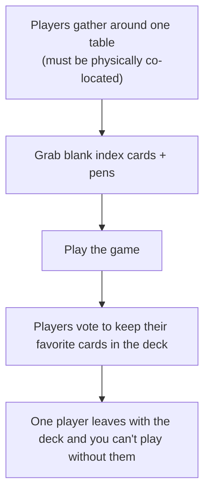
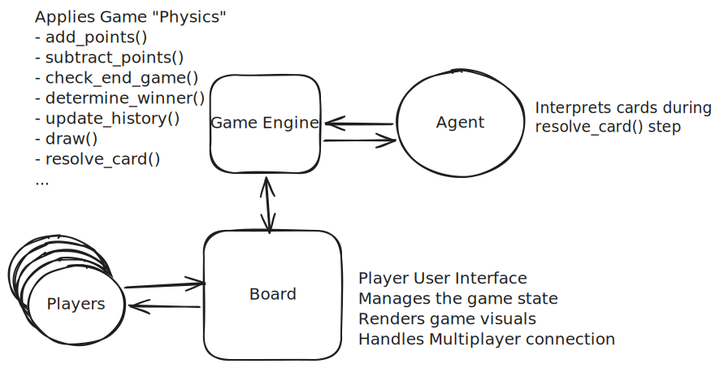
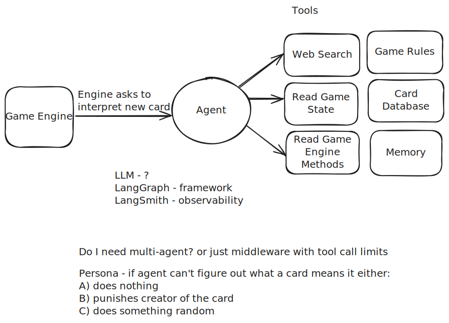
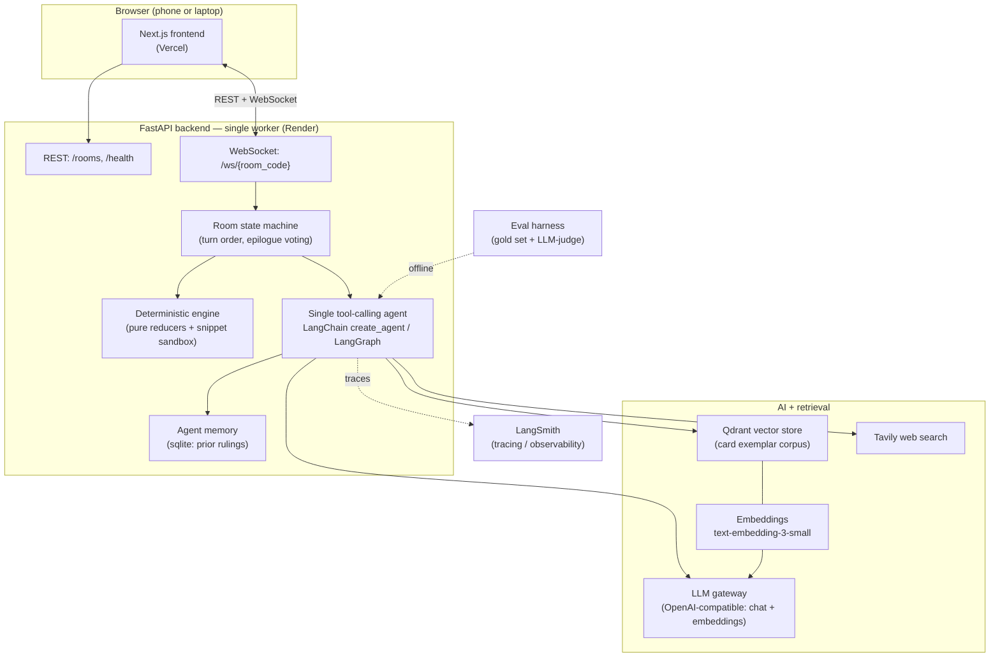
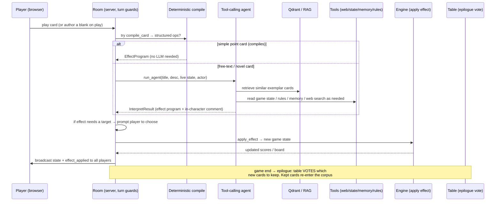
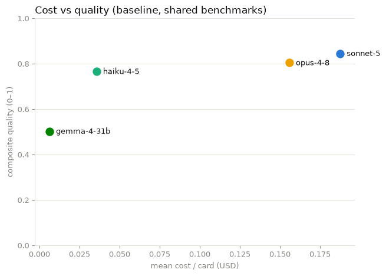

# 1000 Blank White Cards — Certification Challenge Writeup

This is the submission document for **1000 Blank White Cards (TBWC)** — an
AI-arbitrated, real-time party card game. It addresses the seven challenge tasks in
order. It deliberately does **not** repeat the deep technical reference: for module
boundaries, the import-layering contract, the WebSocket flow, the engine + sandbox
model, and the full RAG pipeline, see [`docs/architecture.md`](architecture.md). The
two authoritative hand-authored design sketches are
[`docs/game.excalidraw.svg`](game.excalidraw.svg) (the game-system shape) and
[`docs/agent.excalidraw.svg`](agent.excalidraw.svg) (the agent shape); the Mermaid
diagrams here complement them.

---

## Task 1 — Problem, Audience, and Scope

### Problem (one sentence)

Playing the classic game 1000 Blank White Cards with my friends requires physically being present, which is impossible to do with my old group since many of us live in different states.

### Who has this problem, and why today's answer isn't good enough

Me. I have this problem. So I'm mostly looking for a solution that satifies my needs. 

That said, there are likely people like me. These people are **improv and party-game hobbyists** — the BoardGameGeek / *1000 Blank White Cards* crowd who love games where the rules are emergent and the whole point is that you make cards up as you go. 
Improv games are fun because they combine surprise, collaboration, and low-stakes creativity, giving people permission to build on each other's ideas and discover something unexpected together.
While many games are competitive, improv games are collaborative by nature. If you are the type of player who only cares about winning, well go ahead, write a card that says, "I win" and be done with it. But that's boring, even for the player who wins. The real game comes from building an experience together.

Unfortunately, due to the nature of this type of game, there is no programmable way to build this experience digitally. Without a developer sitting down and coming up with thousands of possible interactions users could think of, he'd still be missing  thousand times more than that. 
So today the only fall back to playing this classic game is to do it with pen and paper. The way it was first played 30+ years ago. This means you have to be co-located. You can't get on Zoom with just one person owning the deck, it just doesn't work.
This is particurally annoying for enthusists, because in this game, you build up the deck one game at a time. And your deck largely depends on your friend group as cards reflect insider jokes and shared memories.

### Today's workflow (how hobbyists play now)

### Example evaluation input → output pairs

The application's core job is to translate a card's free text into the engine's
structured effect vocabulary. These pairs (drawn from
[`data/eval/eval_cards.json`](../data/eval/eval_cards.json), the 35-card gold set) are
the shape of what we evaluate — card text in, canonical interpretation out:

| Card text (input) | Expected interpretation (output) |
| --- | --- |
| *"Gain 5 Points"* — "When you play this card, gain 5 points." | `add_points{target: self, amount: 5}`, immediate, on-play |
| *"Tax Season"* — "Every player loses 10 points. No exceptions." | `add_points{target: all, amount: -10}`, immediate, on-play, center |
| *"Robin Hood"* — "Steal 8 points from the player with the most points." | `steal_points{target: player_with_most_points, amount: 8}`, immediate |
| *"Backwards Day"* — "Reverse the direction of play." | `reverse_order`, immediate, affects all |
| *"Double Draw"* — "From now on, everyone draws 2 cards at the start of their turn." | `change_draw_count{target: all, count: 2}`, **modifier** (persistent), not immediate |
| *"Victory Bonus"* — "When the game ends, whoever holds this card gains points." | `add_points`, **modifier**, `trigger_event: on_game_end` |
| *"Compliment Circle"* — "Give the player on your right a genuine compliment." | no compilable op → social/`custom_note` card; agent picks a persona action |
| *"Blank White Card"* — "This card is intentionally left blank. It does nothing." | `custom_note`, no score change |

The gold set spans every op family (points, steal, skip/extra-turn, reverse,
draw-count, destroy, win-condition, custom-note) and both timings (immediate vs.
persistent modifier), plus the "no mechanical effect / social" cards that force the
agent's fallback persona behaviour.

---

## Task 2 — Proposed Solution

### Solution (one sentence)

A real-time multiplayer web app in which players write and play free-text cards, and an AI agent interprets each card's natural language into executable code that changes the very nature of the game on the fly.

### Infrastructure diagram

Simplified diagrams of core mechanics.

This shows the overall interaction and design of the game.

This shows the agent design. It's a simple single agent with custom crafted tools.

A more detailed mapping of the larger architecture.

**One sentence justifying each component:**

- **LLM (via OpenAI-compatible gateway)** — the core natural-language reasoner that
  reads a free-text card and decides its effect; routing through a single
  OpenAI-compatible gateway ([`src/config.py`](../src/config.py) `Settings`) lets us
  point at hosted OpenAI, a company gateway (e.g. bifrost → Bedrock), or a local
  server (ollama) without touching code, and satisfies the "LLM gateway of your choice"
  requirement. Anthropic's Haiku was picked as the LLM of choice due to it's capability per cost explored more in the eval analysis.
- **Agent orchestration (LangChain `create_agent`, built on LangGraph)** — verified in
  [`src/agent/runtime.py`](../src/agent/runtime.py); a *single* tool-calling agent
  (not multi-agent) with a hard tool-call cap and wall-clock timeout gives the model
  the freedom to look things up while staying bounded and never hanging.
- **Tools (`web_search`, `card_rag_hybrid`, `game_rules`, `mtg_lookup`,
  `read_engine_methods`, `read_game_state`, `agent_memory`, `dry_run`)** — A custom set of tools is the main driver to card interpretation accuracy. Several tools are aimed at helping the model understand what code to write by giving the model access to known good cards and their code via RAG, the game engine methods, game state, etc. Access to web search and the Magic the Gathering api were added to help it understand obscure references and memes, since understanding the game mechanics isn't useful if the agent can't interpret the users intent. The most valuable addition though, is the `dry_run` tool that allows it test code it writes before submitting which helps it catch syntax errors and adjust assumptions. Learn more here: [`src/agent/tools/`](../src/agent/tools/).
- **Embedding model** — turns card text into vectors so we can retrieve
  structurally-similar exemplars; it runs through the one gateway so a single credential drives both chat and embeddings. Production is using `titan-embed-text-v2`, 1024-dim. I've changed it depending on which gateway I hit, OpenAI, ollama, bifrost, but I haven't noticed a difference based on model because I currently only load a small seed dataset of 101 cards (the gold, filler, and simple decks combined).
- **Vector DB (Qdrant, in-memory `cards` collection)** — stores the exemplar-card
  corpus and serves cosine top-k retrieval; in-memory keeps the prototype
  zero-infra while the same client can point at a hosted Qdrant later.
- **Monitoring (LangSmith)** — traces each agent run (tool calls, prompts, judge
  calls) for debugging interpretation quality; wired but off by default behind
  `Settings.langsmith_tracing`.
- **Eval framework (`src/evals` harness + LLM-as-judge)** — an offline harness that
  scores interpretation quality on a hand-annotated gold set, so improvements are
  measured, not asserted (Task 5).
- **Memory (sqlite `agent_memory`)** — persists the agent's own prior card rulings so
  its interpretations stay consistent across cards and games, and survives process
  restarts (the rooms themselves are in-memory).
- **UI (Next.js)** — a browser client so anyone can join a room from a phone or a
  laptop with no install.
- **Deployment (Render backend + Vercel frontend)** — Render runs the single-worker
  FastAPI/WebSocket backend from a Docker image; Vercel serves the Next.js frontend
  at the edge (Task 4).

### Agent-workflow diagram

**How the workflow solves the problem (narrative).** A player's input is a card
they play — and if it's a blank card, they author its title and free-text rule at the
moment they play it. The Room first tries the **deterministic path**: `compile_card`
lowers simple, recognizable cards (plain point changes, skips, draws) straight to
structured ops with no LLM call at all — fast, free, and unambiguous. The agent is
invoked **only when a card carries no compilable ops** (a novel or free-text card).
At that decision point the single tool-calling agent reads the card and reasons about
it, **retrieving** similar past cards from the Qdrant exemplar corpus (RAG) to mirror
known-good effect patterns, and calling other tools as needed: `read_game_state` to
see the live board (who's winning, whose turn), `game_rules` and `read_engine_methods`
to ground itself in the actual effect vocabulary, `agent_memory` to stay consistent
with its own past rulings, and `web_search` (Tavily) to resolve a meme or pop-culture
reference in the card text. It returns a structured `InterpretResult` — an effect
program plus an in-character comment — which the engine applies deterministically to
produce the new game state, broadcast live to every player.

**Human review / approval** shows up in two places. During play, if an effect needs a
choice ("steal from *which* player?"), the server pauses and **prompts the acting
player to choose** before applying. And at game end, the **epilogue vote** lets the
whole table decide which newly-written cards are good enough to keep — the kept cards
are upserted back into the RAG corpus, so human curation directly grows and improves
the exemplar pool the agent learns from. The agent never silently fails: on
cap/timeout/error it returns a deterministic fallback (a persona action or a
`custom_note`), so play always continues.

**Requirements satisfied:** uses an **LLM gateway** (bifrost), has a **memory component** (sqlite agent-memory of prior rulings), and **runs in a browser on phone + laptop** (Next.js client over REST + WebSocket).

---

## Task 3 — Dealing with the Data

### Default chunking strategy — and why

**One card per document (no sub-document splitting).** Each exemplar card is embedded
as a single unit: `upsert_card` (in [`src/agent/rag/store.py`](../src/agent/rag/store.py))
embeds the concatenation of the card's **title + description** and stores the
structured `canonical` effect and `source` as unembedded payload. This is the right
chunking granularity here because the documents are *already* tiny — a card is a title
and a sentence or two of rule text, far shorter than any sensible chunk window.
Splitting a card would destroy exactly the signal we retrieve on: a card's meaning is
the whole title-plus-rule unit, and the retrieval goal is "find cards whose *effect
structure* resembles this one," which only makes sense at the card level. So the
natural atomic document — one card — is also the natural chunk. Point ids are a stable
hash of the card id, which makes re-seeding idempotent.

### Data source and external API, and how they interact

**Personal data source (RAG corpus).** The retrieval corpus is our own curated card
collections: [`data/seed_cards.json`](../data/seed_cards.json) (the exemplar cards
loaded into Qdrant at startup by `rag/seed.py`). We also hand-annotated an eval set
[`data/eval/eval_cards.json`](../data/eval/eval_cards.json) used for evaluation. These
are cards with known-good canonical effects — the "here's how a card like this should
be interpreted" examples the agent imitates. Lastly, we found a source of 700 cards on imgur of real world examples of cards [`data/eval/real_cards.json`](../data/eval/real_cards.json). We use this as a hold out to similate real world evaluations.

As a note, the game inherently ensures our dataset is **not static**: cards the table votes to keep in the epilogue are upserted back in with `source="player"`, so our dataset grows with play.

**External API (Tavily web search).** Tavily is the agent's `web_search` tool
([`src/agent/tools/web_search.py`](../src/agent/tools/web_search.py)), used to resolve
external references a card leans on — a meme, a pop-culture phrase, a game term — that
the model needs to look up to interpret the card faithfully (e.g. "Rickrolled",
"One does not simply walk into Mordor").

A Magic the Gathering API was added as the agent's `mtg_lookup` tool ([`src/agent/tools/mtg_lookup.py`](../src/agent/tools/mtg_lookup.py)) as many game mechanics players may riff off of are likely to come from this game.

**How they interact during a turn.** When the agent interprets a free-text card, it
first leans on the **personal corpus (Qdrant RAG)** to find structurally-similar
exemplars and mirror their canonical effect patterns — this is the primary grounding.
It reaches for the **external API (Tavily)** only opportunistically, when the card
references something outside the game that isn't resolved by the exemplars. RAG
answers "what kind of effect is this, mechanically?"; web search answers "what does
this cultural reference mean?" Both are defensively non-fatal — a missing Tavily key
or an offline gateway degrades gracefully to a smaller toolbox rather than breaking
the turn.

---

## Task 4 — End-to-End Agentic RAG Prototype

The prototype is **built end-to-end and deployed to public endpoints**, live as of
2026-07-15:

- **Play it:** <https://a-thousand-blank-white-cards.vercel.app>
- **Backend** — the FastAPI + WebSocket server (single worker) runs on **Render**
  at <https://a-thousand-blank-white-cards.onrender.com>, built from the repo's
  Docker image with a `/health` health check. Steps:
  [`docs/deploy/render-steps.md`](deploy/render-steps.md).
- **Frontend** — the Next.js client is served by **Vercel**. Steps:
  [`docs/deploy/vercel-steps.md`](deploy/vercel-steps.md).
- **Observability** — LangSmith setup:
  [`docs/deploy/langsmith-setup.md`](deploy/langsmith-setup.md).
- **Post-deploy smoke test** — [`docs/deploy/smoke-checklist.md`](deploy/smoke-checklist.md).
  The automated probe (health, CORS, WebSocket round-trip, frontend page,
  cross-origin wiring, plus LLM/Tavily/LangSmith credential checks) passes against
  the deployed pair.

The full stack runs the loop described in Task 2: browser → REST/WebSocket → room
state machine → deterministic engine and/or the tool-calling agent (with Qdrant RAG +
Tavily) → live broadcast back to every player. Note: the deployment is a free-tier
POC — services spin down when idle (cold starts up to ~1 minute) and game/RAG state
is in-memory (see the persistence caveats in
[`docs/deploy/render-steps.md`](deploy/render-steps.md)).

---

## Task 5 — Evals

### Dataset

A **35-card hand-annotated gold set** ([`data/eval/eval_cards.json`](../data/eval/eval_cards.json)).
Each card carries a structured `human_canonical` label (timing, target, placement,
trigger_event, ops, magnitude_sign) that spot-checks as correct and consistent with the
engine's op vocabulary. It is small (n=35) — good for a directional baseline, too small
for tight confidence intervals. It is joined by a 25-card compositional [`eval_hard` suite](../data/eval/eval_cards_hard.json) that tests for complex mechanics, as well as a large 700 card dataset created from [real cards](../data/eval/real_cards.json), and the 101-card seed corpus as additional benchmarks (`config.EVAL_BENCHMARKS`).

### Harness and scorers

The harness ([`src/evals/`](../src/evals/)) simulates the agent running in production, with game state fixures and mocks. There are a host of metrics covered, several LLM-as-judge covering topics like intent match and target accuracy, as well as several deterministic metrics like executibility of code, cost, latency. I found one of the most valuable metrics to watch was `did_something` which just tracks if the agent changes the game state at all. This turned out to be a good proxy for `fun`, because even if the agent does something "wrong", random, or unexpected that still aligns well with the goals of a improv game.

Please see the [eval notebook](../scripts/evals.ipynb) for more information on metrics used.

### Conclusions

Every run is persisted to `data/eval/runs/` with its full config, per-card rows, tool-call counts, tokens, cost, and latency. This allows us to run eval experiments and then analyze the results after. We ran experiments comparing different models, benchmarks, tool budget, and tools.

Please see the [eval analysis notebook](../scripts/analyze_evals.ipynb) for more information on evaluation results and conclusions drawn.

---

## Task 6 — Improving the Prototype

### Advanced retriever — BM25 + dense hybrid with Reciprocal Rank Fusion

The advanced retrieval technique is **hybrid retrieval**: the dense (cosine) search
is fused with a **BM25** keyword pass over the same card corpus using **Reciprocal
Rank Fusion** (`hybrid_retriever()` / `_rrf()` in
[`src/agent/rag/retrievers.py`](../src/agent/rag/retrievers.py), exposed to the agent
as the [`card_rag_hybrid`](../src/agent/tools/card_rag_hybrid.py) tool). **Why it
fits TBWC:** card queries hinge on rare, exact game-mechanic keywords — *draw*,
*discard*, *steal*, *swap*, *skip* — that dense similarity blurs into generic
"points-and-cards" neighborhoods, while BM25 excels at exactly those rare tokens; RRF
fuses the two ranked lists without score-scale problems. Each call builds the BM25
index fresh from `store.list_all_cards()`, so kept cards from live games are
searchable immediately, and both legs see the identical corpus.

### Before / after results

The A/B uses the production eval harness with the `enabled_tools` filter: two arms
identical except for which card-RAG tool the agent gets (dense `card_rag` vs.
`card_rag_hybrid`). Benchmark: **seed** (101 cards — the corpus with real precedent
overlap, and where the agent actually calls card-RAG), haiku-4-5, tool cap 12,
LLM judge on:

| Metric | dense `card_rag` | `card_rag_hybrid` | delta |
| --- | ---: | ---: | ---: |
| intent_match | 0.622 | 0.627 | +0.005 |
| target_accuracy | 0.713 | 0.700 | −0.013 |
| persistence_accuracy | 0.771 | 0.830 | **+0.059** |
| magnitude_sign | 0.780 | 0.816 | **+0.036** |
| dsl_validity | 0.754 | 0.754 | 0.000 |
| executability | 0.739 | 0.739 | 0.000 |
| sandbox_behavior | 0.355 | 0.370 | +0.014 |
| card-RAG tool calls | 15 | 19 | +4 |
| mean tool calls / card | 4.90 | 4.65 | −0.25 |
| run cost (USD) | 2.41 | 2.28 | −0.13 |

A qualified win: persistence and magnitude judged meaningfully better, everything
else at parity, and the run is slightly cheaper with *more* retrieval (the fused
results resolve cards in fewer other tool calls). Two honest caveats. First, on the
`eval_hard` benchmark the A/B is a wash by construction — the agent calls card-RAG
~3 times in 25 cards there, so retrieval quality can't move those numbers. Second,
single-sample judge variance means the small deltas are directional, not proof;
the +0.059/+0.036 lifts are the ones outside typical noise.

### One other change — model choice and tool-call budget

The second improvement was measured with the identical harness:
pick the serving model and bound the agent's tool budget. The model sweep
(`eval` / `eval_hard` benchmarks) showed sonnet-5 is the quality ceiling but ~6× the
cost, gemma-4-31b collapses (≈0.50 intent_match, ~0.48 invalid rate), and haiku-4-5
is the price/quality sweet spot.

I had been using Sonnet up to this point, but switched to Haiku as it had comparitive performance but much better cost savings. Fixing haiku and sweeping `max_tool_calls` on
`eval_hard` (`MAX_TOOL_CALLS` in [`src/agent/runtime.py`](../src/agent/runtime.py),
default was 24):

| Metric | cap 6 | cap 12 | cap 18 | uncapped (24) |
| --- | ---: | ---: | ---: | ---: |
| intent_match | 0.680 | 0.840 | 0.694 | **0.852** |
| target_accuracy | 0.700 | **0.874** | 0.692 | 0.840 |
| persistence_accuracy | 0.772 | **0.936** | 0.772 | 0.844 |
| dsl_validity | 0.880 | **0.960** | 0.840 | 0.880 |
| executability | 0.880 | **0.960** | 0.840 | 0.880 |
| invalid rate | 0.200 | **0.040** | 0.120 | **0.040** |

A cap of 12 dominates: versus the old 24 it lifts `dsl_validity`/`executability`
0.88 → 0.96 and `persistence_accuracy` 0.844 → 0.936 at equal intent, while 6 starves
the agent (invalid rate 0.04 → 0.20) and 18 lets it wander. 

Tool-ablation runs backed the full toolbox: cutting the agent down to just state/engine/dry-run tools dropped `intent_match` to 0.766 (and to 0.508 without `read_engine_methods`). The cap is now 12 in production, demonstrated end-to-end by the eval harness rather than asserted.

---

## Task 7 — Next Steps

**What to keep for Demo Day:**

- **The realtime browser stack** 
  (Next.js + WebSocket, Render + Vercel) — it directly answers the co-location pain and needs no install for demo participants.
- **The game engine**
  The game engine is relatively robust and allows for some fun complex play.
- **The frontend design**
  I think the game looks pretty slick, with both a light and dark mode. I even was able to build some of my stretch goals like a drawing canvas for the cards.

**What to change or improve, and why:**

- **Collect user feedback**
  I want to play test this with several groups so I can prioritize their feedback. I have a long list of improvement ideas so it would help me prioritize the most popular ones. It would also allow me to collect a larger corpus of cards to play test against. I attempted to do this with a board game group I play with, but the timing didn't align this week between having to actually build it and meeting the deadline. 
- **Add more game functions**
  While the agent can do practically anything to the game state and engine, it can't actually change the game board and interactions. So for example, if a user wanted to do a dice roll mechanic. It could run a randomizer to simulate a dice roll, but user wouldn't actually visually see a dice being rolled on the front end.
- **Set up a Multi-Agent Workflow** 
  The current system uses a single agent+tool call system. When I was still building the game engine, I vibe coded the agent arbiter system and it was a complex multi-agent system that added little value. Having seen both, a simple workflow of three agents would likely work best. A step to identify the user's intent, a step to identify game mechanics and create a plan, and a fianl step to write the code.
- **Play test on phone more**
  I did load and run it on my phone, but not extensively to ensure it was a fully mobile friendly game. This game allows you to select an "In person" option when creating a room and making sure it runs smoothly on mobile would be key to that.

---

## Link to Demo Recording

Shareable link: https://flexion-us.zoom.us/rec/share/3DQUoWd04mP3TfUSDYz_I7UT-3Hai3FkdjFT4SBzAZwIl1Or_vakZd_qan_1mlUy.tmfMMLqJMYWU3r4u
Passcode: ?5o7HmGJ
