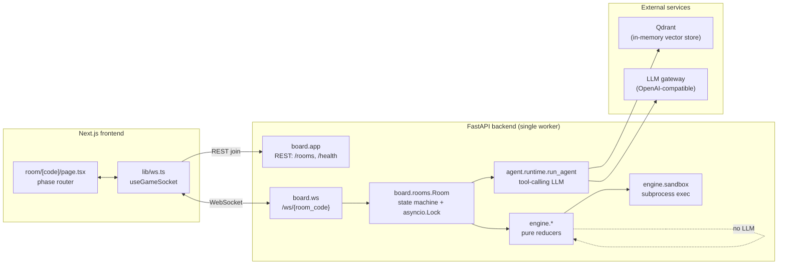
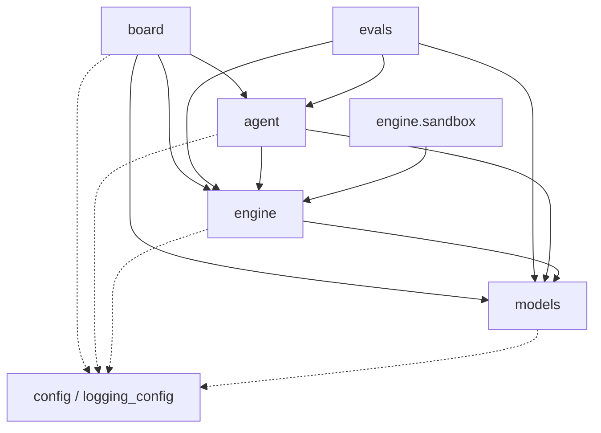
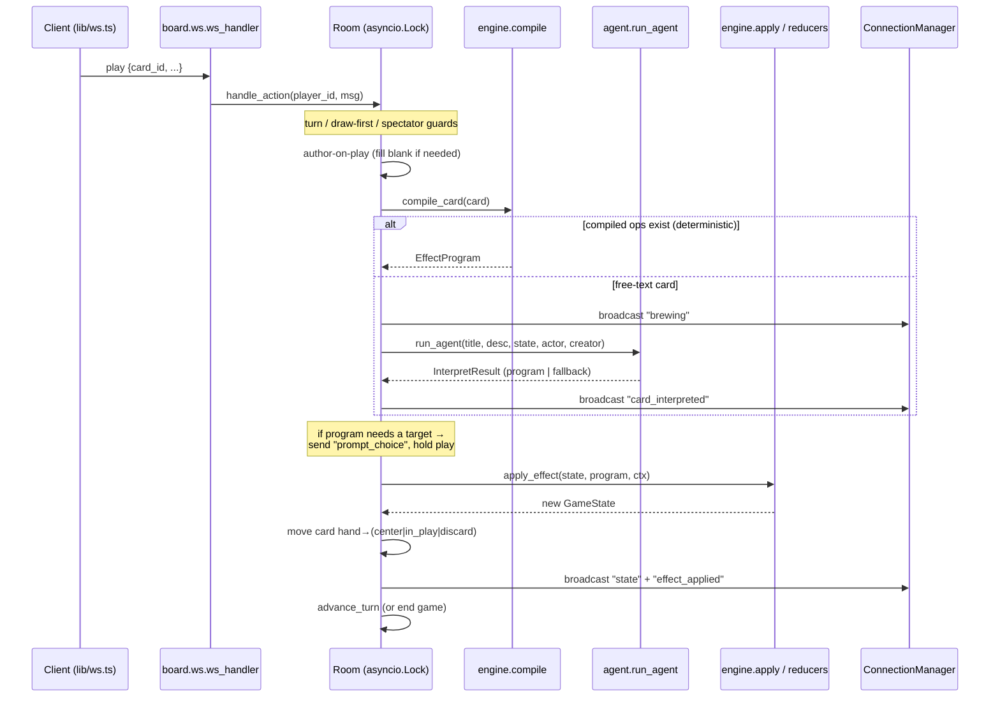
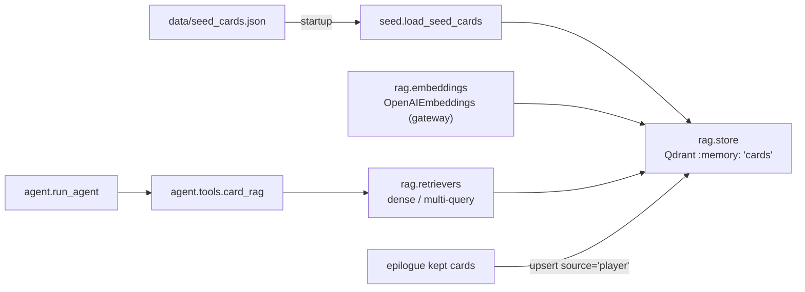

# Architecture

A durable technical reference for **1000 Blank White Cards** — an AI-arbitrated,
real-time party card game. This document describes the running system: its
module boundaries, the import-layering contract the tests enforce, how a client
action travels through the stack, the deterministic engine + snippet sandbox,
and the RAG pipeline that grounds the interpretation agent.

> Scope note: this file is the technical reference. Narrative / submission
> context lives in `docs/WRITEUP.md`; setup lives in the README. The two
> hand-authored diagrams `docs/agent.excalidraw.svg` and `docs/game.excalidraw.svg`
> are the owner's authoritative design sketches — the Mermaid diagrams below
> complement them, and any place the code has since diverged is called out
> under [Diagram reconciliation](#7-diagrams).

---

## 1. Overview

The system is a Next.js frontend talking to a FastAPI backend over both REST
(room lifecycle) and a WebSocket (live gameplay). The backend owns an in-memory
game state per room and routes each played/authored card through a two-tier
interpreter: a **deterministic engine** (pure reducers that lower structured
"ops" onto game state) and, only when a card carries no compilable ops, a
**single tool-calling LLM agent** that reads the live board and RAG-retrieved
exemplars to interpret free-text cards in character. Retrieval is backed by an
in-memory Qdrant vector store; both chat and embeddings go through one
OpenAI-compatible LLM gateway configured in a single `Settings` object.

The backend is deliberately **single-worker**: room state lives in
process-local memory (see [§4](#4-request--websocket-flow)).

---

## 2. Module map

All backend code lives flat under `src/`.
Imports are `board.*`, `models.*`, `agent.*`, `engine.*`, `evals.*`, and the
top-level `config` / `logging_config` modules. Run the backend with
`uvicorn board.app:app`.

| Package | Responsibility | Key files |
| --- | --- | --- |
| **`config`** (`src/config.py`) | Single source of truth for all settings: the one OpenAI-compatible LLM gateway (`llm_base_url` / `llm_api_key` / `llm_extra_headers`, driving BOTH chat and embeddings), embedding dimensions, Qdrant, LangSmith, CORS, sandbox flag, and the `dev_mode` flag (gates room persistence + `/dev` endpoints). Cached `get_settings()` singleton. | `config.py` (`Settings`, `get_settings`, `warn_if_no_llm_credentials`) |
| **`models`** | Pure data models, no game logic. `GameState`/`Player`/`WinCondition`; the runtime effect `Op` discriminated union + `EffectProgram` + `Target`/`CardTarget` + `map_authoring_target`; card authoring models; the client/server WebSocket envelopes. | `game_state.py`, `effects.py`, `card.py`, `cards.py`, `ws_messages.py` |
| **`engine`** | The game "physics": pure reducers over `GameState`, the turn loop, scoring/win-condition, card compilation, the event bus + persistent hooks, and the untrusted-snippet execution sandbox. Never calls the LLM. | `facade.py` (`GameEngine`), `reducers.py` (`apply_op`), `apply.py` (`apply_effect`), `compile.py` (`compile_card`), `loop.py` (`advance_turn`, `draw_step`), `scoring.py`, `events.py`, `hooks.py`, `epilogue.py` (`tally_votes`), `sandbox/` |
| **`agent`** | The single tool-calling interpretation agent: the persona system prompt, the interpretation result contract, the LLM factory, the RAG pipeline, and the bound toolbox. Reaches down into `engine`/`models` but never up into `board`. | `runtime.py` (`build_agent`, `run_agent`), `contract.py` (`InterpretResult`), `persona.py`, `llm.py` (`get_chat_model`), `rag/` (`embeddings`, `store`, `retrievers`, `seed`), `tools/` |
| **`board`** | The server surface: FastAPI app factory + REST routes, the WebSocket endpoint, and the room state machine (turn enforcement, deck building, epilogue voting, connection registry). The only layer that orchestrates engine + agent together. | `app.py` (`create_app`), `ws.py` (`ws_handler`), `rooms/` (`room.py`, `manager.py`, `connections.py`, `deck.py`, `epilogue.py`, `store.py`) |
| **`evals`** | Offline evaluation of the interpretation pipeline: a self-contained harness, an LLM-as-judge, scorers, and A/B experiments (retriever, improvement). Not part of the serving path. | `harness.py`, `judge.py`, `scorers.py`, `eval_core.py`, `retriever_ab.py`, `improvement_ab.py`, `conclusions.py` |

---

## 3. Import-layering contract

Layering is enforced **statically** by `tests/test_layering.py`, which parses
every module under `src/` with `ast` (it never imports them, so it is fast and
free of side effects) and checks the top-level package of each import against
the rules below. Only the first dotted segment matters (`agent.rag.store` →
`agent`); relative imports are ignored because they cannot cross a top-level
boundary.

**Shared infra** — `config` and `logging_config` — may be imported by any
layer (`_INFRA` in the test).

The dependency rules, exactly as the test encodes them:

| Layer | May import | Must NOT import | Enforced by |
| --- | --- | --- | --- |
| `models` | (foundation — infra only) | `engine`, `agent`, `board`, `evals` | `test_models_imports_no_higher_layer` |
| `engine` | `models`, infra, and `engine.sandbox` (lives under engine) | `agent`, `board`, `evals` | `test_engine_imports_no_higher_layer` |
| `agent` | `engine`, `models`, infra | `board`, `evals` | `test_agent_imports_no_higher_layer` |
| `engine.sandbox` | `engine` (documented lazy coupling: `sandbox.revalidate` → `engine.apply`) | `agent`, `board`, `evals` | `test_engine_sandbox_may_import_engine` |

`board` and `evals` are the top of the stack; nothing forbids what they import,
so `board` is the single place where `engine` and `agent` are composed together
(the room orchestrates a play by first trying `compile_card` and only then
`run_agent`). `test_src_layout_exists` additionally guards the directory shape
(`agent/rag`, `engine/sandbox`, `board/rooms` must exist), so a future
restructure can't silently make the layering tests pass by testing nothing.

Directional summary:

This is why the `GameEngine` facade (`engine/facade.py`) deliberately keeps its
`resolve_card` **deterministic-only**: LLM interpretation would require reaching
the `agent` layer, which the engine may not do. That orchestration lives one
layer up in `board.rooms.room.Room._resolve_program`.

---

## 4. Request / WebSocket flow

### Room lifecycle (REST)

Rooms are created and joined over REST (`board.app.create_app`):

- `POST /rooms` → `RoomManager.create_room(mode)` returns a 6-char code.
- `POST /rooms/{code}/join` → `RoomManager.join(code, name)` returns a
  `player_id` (an opaque UUID the client stores per-room in `sessionStorage`)
  and a `spectator` flag. **Join policy**: a joiner arriving while the room is
  in the `lobby` phase becomes a real player; a joiner arriving after the game
  has started becomes a spectator (observes, cannot act).
- `GET /rooms/{code}/state` → read-only debug snapshot.
- `GET /health` → liveness.
- `POST /rooms/{code}/dev/skip-setup`, `POST /rooms/{code}/dev/end-game` →
  dev-loop shortcuts, active only when `DEV_MODE` is set (they 404 otherwise).
  Skip-setup auto-authors each player's cards and fast-forwards to `playing`;
  end-game forces the current game through the real `_end_game` path so
  end-game triggers, scoring, and the epilogue can be exercised on demand.

Rooms are stored via the `RoomStore` protocol (`board/rooms/store.py`). The
default is `InMemoryRoomStore` — **process-local, single-worker only** — cleared
on restart. Under `DEV_MODE` the singleton swaps in `FileRoomStore`, which
persists each room to `.devstate/rooms/<code>.json` after every mutation (via a
`Room.on_change` hook) and rehydrates them on startup so games survive a
`--reload`; it is a dev convenience, not a durable multi-worker backend. Because
REST-join and the WebSocket connect must hit the same worker to see the same
room, `check_single_worker()` warns at startup if `WEB_CONCURRENCY > 1`. A
distributed backend (Redis, etc.) can implement the same Protocol without
touching `RoomManager`.

### Live gameplay (WebSocket)

`board.ws.ws_handler` serves `/ws/{room_code}`. FastAPI/OpenAPI does not
document WebSocket routes, so the wire protocol is described in the app's
OpenAPI `description` (`WS_PROTOCOL_DESCRIPTION` in `board/app.py`).

Envelopes are typed in `models/ws_messages.py`. Inbound messages form a Pydantic
discriminated union (`ClientMsg`, keyed on `type`) validated by a single
`TypeAdapter`; outbound messages are the `ServerMsg` set.

- **Client → server**: `join`, `start`, `draw`, `play`, `pass` / `end_turn`,
  `create_card`, `preview_card`, `epilogue_vote`.
- **Server → client**: `state`, `brewing`, `card_interpreted`, `effect_applied`,
  `preview_result`, `prompt_choice`, `epilogue`, `error`.

**Handshake and close codes** (`board/ws.py`): the socket is accepted, then the
first message MUST be a `join` carrying a valid `player_id`. The frontend
(`lib/ws.ts` → `closeCodeMessage`) mirrors these codes:

| Close code | Meaning |
| --- | --- |
| `4000` | Bad handshake — first message was not a valid `join`. |
| `4001` | Unknown `player_id` (not registered via REST join for this room). |
| `4004` | Room not found. |
| `4009` | Connection replaced by a newer socket for the same player (duplicate tab). |

On (re)connect the server immediately replays a full `state` snapshot, so a
refresh restores the whole game (including `state.log`, which is why every
effect line is persisted there and not only broadcast live).

### Anatomy of an action

Every inbound message is serialized through a per-room `asyncio.Lock`
(`Room.handle_action` → `Room._dispatch`), so concurrent sockets cannot corrupt
turn order. Spectators are rejected from all game-mutating message types.

Key behaviours enforced in `Room`:

- **Turn model is draw → play → end** (`draw` first, explicit; playing/passing
  before drawing is rejected while the deck is non-empty). Drawing the last card
  latches `_deck_exhausted`; the drawer finishes their turn, then the game ends.
- **Author-on-play**: the game is *A Thousand Blank White Cards*, so a blank card
  is authored at the moment it's played. `_handle_play` persists the authored
  `title`/`description` and clears the `blank` flag **before** interpreting, so a
  `prompt_choice` follow-up (which re-sends only `card_id` + the choice)
  re-resolves the now-real card identically.
- **Play never silently no-ops** (`_resolve_program`): compiled ops → best-effort
  agent → deterministic `CustomNoteOp` fallback.
- **End game → epilogue**: `resolve_end_of_game` applies any `on_game_end` card
  effects, `evaluate_win_condition` computes `winner_ids`, then voting opens
  (`EpilogueManager`); kept cards are upserted back into the RAG corpus.

---

## 5. Engine reducer + sandbox model

### Ops, compilation, and reducers

A card's mechanical effect is an `EffectProgram` — a list of `Op`s from the
discriminated union in `models/effects.py` (`add_points`, `subtract_points`,
`set_points`, `steal_points`, `skip_turn`, `extra_turn`, `reverse_order`,
`change_draw_count`, `draw_cards`, `destroy_card`, `set_win_condition`,
`custom_note`). Each op addresses players via a `Target`
(`self`, `left_neighbor`, `all_others`, `chooser`, `player_with_most_points`, …)
and, for card manipulation, a `CardTarget` (`this`, `chosen_card`,
`all_in_play`, `all_in_hand`).

Two paths produce a program:

1. **Deterministic compile** (`engine/compile.py::compile_card`) lowers a card's
   authoring-vocabulary ops (`card["ops"]` or `card["canonical"]["ops"]`) onto
   the runtime `Op` union. Target aliasing is delegated entirely to
   `models.effects.map_authoring_target`; unknown or malformed ops are skipped
   with a debug log. If nothing compiles, it returns `None` (signalling the
   caller to try the LLM). Choice targets flip `EffectProgram.requires_choice`.
2. **Agent interpretation** (§6) produces an `InterpretResult` whose `program`
   is an `EffectProgram` (or a `snippet`).

Application is pure and immutable — reducers take `(state, op, ctx)` and return
a **new** `GameState`, never mutating the input:

- `engine/reducers.py::apply_op` dispatches an op through the `_REDUCERS` table.
  `_resolve_targets` / `_resolve_card_targets` turn a `Target`/`CardTarget` +
  `HookContext` into concrete id lists (raising if a `chooser`/`chosen_card`
  arrives without a resolved choice — which the Room guards against by prompting).
- `engine/apply.py::apply_effect` iterates a program's ops and emits
  `ON_SCORE_CHANGE` after any op that changed a score, so persistent hooks react.
- `engine/loop.py` owns `advance_turn` (honouring `direction`, per-player
  skip-next / extra-turn flag sets carried as `PrivateAttr` on `GameState`, a
  named skip-predicate registry, and spectator-skipping) and `draw_step`.
- `engine/events.py` / `engine/hooks.py` provide the synchronous `EventBus`,
  `HookContext`, and the `fire_hooks` ordering algorithm (player-scoped hooks
  fire before center-scoped "house rule" hooks; an `uncounterable` source card
  ends the chain early).
- `engine/facade.py::GameEngine` is a thin, stateless ergonomic wrapper naming
  the "physics" surface from the design diagram (`add_points`, `subtract_points`,
  `draw`, `resolve_card`, `check_end_game`, `determine_winner`,
  `update_history`). Every method delegates to the underlying pure function and
  reimplements no logic; `resolve_card` is deterministic-only by design.

### The snippet sandbox

Genuinely novel effects that no combination of ops can express can be expressed
as a generated Python hook (`SnippetEffect.code`: the body of
`def apply(state, ctx)`). `engine/sandbox/` isolates that untrusted code:

- **`validate.py`** — a static AST allowlist run *before* code is ever stored or
  executed: no `import`/`from`-import, no `exec`/`eval`/`open`/`compile`/
  `__import__`/`breakpoint` calls, no dunder attribute access, and exactly one
  top-level function named `apply`.
- **`api_surface.py`** — the snippet's `apply` receives a restricted
  `SandboxGame` façade, never raw `GameState`. It exposes read-only player views
  and whitelisted mutators (`add_points`, `subtract_points`, `set_points`,
  `skip`, `set_draw_count`, `note`) that only **record op dicts** — they cannot
  touch real state.
- **`runner.py`** — `execute_snippet` spawns an isolated subprocess
  (`python -I` via `_child_runner.py`) with a wall-clock timeout; the child
  emits the recorded op diff as JSON. **The subprocess is the security boundary**
  (in-process exec is not); production would swap in gVisor/Firecracker or a
  hosted exec service. Gated by `Settings.snippet_execution_enabled`.
- **`revalidate.py`** — the final net: the child's op diff is re-parsed through
  the same Pydantic `Op` union (capped at 50 ops) and applied through the
  **same engine reducers** as a normal play. Snippets get no special mutation
  path — this is the documented lazy coupling `engine.sandbox → engine.apply`.

So the sandbox isolates: (1) *what code can be written* (AST allowlist), (2)
*what it can reach* (`SandboxGame` façade, not `GameState`), (3) *where it runs*
(subprocess + rlimit + timeout), and (4) *what it can ultimately do* (re-validated
ops through the normal reducers).

---

## 6. RAG pipeline

The agent grounds its interpretation in exemplar cards stored in Qdrant. The
whole pipeline lives under `agent/rag/` and, like the rest of `agent`, reads its
provider config from the one `Settings` gateway.

- **Embeddings** (`rag/embeddings.py`): a cached `OpenAIEmbeddings` singleton
  pointed at the configured gateway. The vector size is
  `Settings.embedding_dimensions` (default 1536 for `text-embedding-3-small`;
  override for other models), which is threaded into the Qdrant collection so
  sizes always match. `embed_text_cached` / `embed_texts_cached` add a
  disk-backed content-hash cache (`.embedding_cache.json`, keyed by
  model + dimensions + text) so unchanged cards are never re-embedded across
  reloads; the model/dimensions in the key invalidate the cache automatically
  when the embedding model changes.
- **Store** (`rag/store.py`): an in-memory Qdrant client (`location=":memory:"`)
  managing one `cards` collection (cosine distance). `upsert_card` embeds
  `title + description` and stores `canonical`/`source` as payload (not
  embedded); point ids are a stable blake2b hash of the card_id so re-seeding is
  idempotent. `search(query, k)` returns the top-k payloads with scores;
  `list_all_cards()` scrolls all payloads offline (no embedding call) and is the
  card source for deck building.
- **Seeding** (`rag/seed.py`): at startup `board.app`'s lifespan best-effort
  calls `load_seed_cards`, which `init_store()`s and upserts
  `data/seed_cards.json` in one batched `upsert_cards` call (a single embedding
  round-trip for cache misses). A missing file or offline gateway degrades
  gracefully.
- **Retrievers** (`rag/retrievers.py`): `dense_retriever()` is the baseline
  cosine retriever; `advanced_retriever()` is a `MultiQueryCardRetriever` that
  paraphrases the query via the chat model, retrieves each paraphrase, and
  returns the deduplicated union.
- **How the agent uses it** (`agent/runtime.py`, `agent/tools/`): `run_agent`
  builds a LangChain tool-calling agent (`create_agent`) with the persona system
  prompt and a bound toolbox. `get_default_tools()` returns the context-free
  tools — web search, the card-RAG corpus, game rules, MTG lookup, agent memory,
  and `read_engine_methods`; the context-dependent `read_game_state` tool
  (closing over the live snapshot + actor/creator) is bound per invocation. The
  agent decides when to retrieve exemplars via the card-RAG tool rather than
  stuffing context unconditionally. It is bounded by a hard tool-call cap
  (`MAX_TOOL_CALLS`) and a wall-clock timeout (`AGENT_TIMEOUT_SECONDS`), and
  **never raises to its caller** — on cap/timeout/error it returns a
  deterministic `InterpretResult` with `verdict="invalid"`.

The **persona** (`agent/persona.py`) makes the agent a sardonic game master: it
always emits an in-character `comment`, and when a card can't be cleanly
interpreted it picks a `persona_action` — `do_nothing` (undecipherable, player
is NOT the author), `punish_author` (undecipherable, player IS the author),
`chaos_monkey` (well-meant but ambiguous), or `random_solution` (multiple valid
readings). Kept cards from the epilogue vote are upserted back into the store
with `source="player"`, so the corpus grows across games.

---

## 7. Diagrams

The authoritative, hand-authored design sketches:

- **`docs/game.excalidraw.svg`** — the game-system shape: **Board** (player UI,
  renders visuals, manages game state, handles multiplayer connection) ↔ **Game
  Engine** (applies game "physics": `add_points()`, `subtract_points()`,
  `check_end_game()`, `determine_winner()`, `update_history()`, `draw()`,
  `resolve_card()`) with the **Agent** interpreting cards during the
  `resolve_card()` step.
- **`docs/agent.excalidraw.svg`** — the agent shape: the **Game Engine** asks the
  **Agent** to interpret a new card; the agent has tools (**Web Search**, **Read
  Game Engine Methods**, **Memory**, **Game Rules**, **Read Game State**, **Card
  Database**), an LLM, LangGraph as framework, LangSmith for observability, and a
  **Persona** with fallback behaviours.

The Mermaid diagrams in [§1](#1-overview), [§3](#3-import-layering-contract),
[§4](#4-request--websocket-flow), and [§6](#6-rag-pipeline) complement these by
showing the actual module boundaries and message flow.

### Diagram reconciliation

Where the implemented code has since diverged from the authoritative SVGs (the
SVGs are the source of intent; these are notes, not contradictions):

1. **`resolve_card()` and LLM interpretation** (`game.excalidraw.svg`). The
   diagram shows the Agent interpreting cards "during the `resolve_card()`
   step". In code, the `GameEngine.resolve_card` facade method
   (`engine/facade.py`) is intentionally **deterministic-only** — it never calls
   the LLM, because the layering contract forbids `engine → agent`. The
   equivalent orchestration (compile → LLM → `CustomNote` fallback) lives one
   layer up in `board.rooms.room.Room._resolve_program`. The *conceptual* step
   is the same; the *code boundary* is one layer higher than the sketch implies.

2. **Persona branches** (`agent.excalidraw.svg`). The diagram lists three
   fallback behaviours (A: does nothing, B: punishes creator, C: does something
   random). The implemented `persona_action` vocabulary has **four**: `do_nothing`,
   `punish_author`, `chaos_monkey`, and `random_solution` — i.e. the diagram's
   "does something random" was split into a well-meant-but-ambiguous branch
   (`chaos_monkey`) and a pick-a-reading-at-random branch (`random_solution`),
   plus the `none` value for cleanly-interpreted cards.

3. **"Multi-agent or middleware?" / LLM / framework** (`agent.excalidraw.svg`).
   The sketch poses the open question "Do I need multi-agent, or just middleware
   with tool-call limits?" and marks the LLM as undecided ("LLM - ?"). The code
   resolves these: a **single** tool-calling agent (`agent/runtime.py`, one
   `create_agent`) with a hard tool-call cap and wall-clock timeout — no
   multi-agent orchestration — over a **generic OpenAI-compatible gateway**
   (`config.Settings`, one base_url/key for both chat and embeddings). The
   framework is LangChain's `create_agent` (built on LangGraph — the recursion
   cap surfaces as `GraphRecursionError`), and LangSmith tracing is wired but
   off by default behind `Settings.langsmith_tracing`.

4. **Tool names.** The six agent tools in `agent/tools/` map to the sketch's tool
   nodes: `web_search` → Web Search, `card_rag` → Card Database, `game_rules` →
   Game Rules, `read_engine_methods` → Read Game Engine Methods, `read_game_state`
   → Read Game State, `agent_memory` → Memory. (`mtg_lookup` is an additional
   tool not drawn in the sketch.)
